# Applications Django - MediaBib

Ce document présente un récapitulatif complet de toutes les applications Django du projet MediaBib, leurs responsabilités, modèles, fonctionnalités et dépendances.

---

## Table des matières

1. [Vue d'ensemble](#vue-densemble)
2. [État actuel](#état-actuel)
3. [Applications prévues](#applications-prévues)
   - [core](#1-core)
   - [sites](#2-sites)
   - [catalog](#3-catalog)
   - [items](#4-items)
   - [patrons](#5-patrons)
   - [circulation](#6-circulation)
   - [acquisitions](#7-acquisitions)
   - [serials](#8-serials)
   - [opac](#9-opac)
   - [rfid](#10-rfid)
   - [digital](#11-digital)
   - [events](#12-events)
   - [reports](#13-reports)
   - [notifications](#14-notifications)
4. [Diagramme de dépendances](#diagramme-de-dépendances)
5. [Ordre de développement](#ordre-de-développement)

---

## Vue d'ensemble

MediaBib est organisé en **14 applications Django** principales, chacune responsable d'un domaine fonctionnel spécifique du SIGB. Cette architecture modulaire permet :

- **Séparation des responsabilités** : Chaque application gère un domaine métier distinct
- **Réutilisabilité** : Les applications peuvent être développées et testées indépendamment
- **Maintenabilité** : Code organisé et facile à maintenir
- **Évolutivité** : Ajout de nouvelles fonctionnalités sans impacter les autres modules

### Architecture générale

```
┌─────────────────────────────────────────────────────────────┐
│                    APPLICATIONS DJANGO                        │
├─────────────────────────────────────────────────────────────┤
│                                                               │
│  ┌──────────┐  ┌──────────┐  ┌──────────┐  ┌──────────┐   │
│  │   core   │  │  sites   │  │ catalog  │  │  items   │   │
│  └──────────┘  └──────────┘  └──────────┘  └──────────┘   │
│                                                               │
│  ┌──────────┐  ┌──────────┐  ┌──────────┐  ┌──────────┐   │
│  │ patrons  │  │circulation│  │acquisitions│ │ serials  │   │
│  └──────────┘  └──────────┘  └──────────┘  └──────────┘   │
│                                                               │
│  ┌──────────┐  ┌──────────┐  ┌──────────┐  ┌──────────┐   │
│  │   opac   │  │   rfid    │  │ digital  │  │ events   │   │
│  └──────────┘  └──────────┘  └──────────┘  └──────────┘   │
│                                                               │
│  ┌──────────┐  ┌──────────┐                                │
│  │ reports  │  │notifications│                              │
│  └──────────┘  └──────────┘                                │
│                                                               │
└─────────────────────────────────────────────────────────────┘
```

---

## État actuel

### Application existante

#### `home`

**Statut** : ✅ Implémentée

**Description** : Application de base pour la page d'accueil et les pages statiques.

**Fonctionnalités actuelles** :
- Page d'accueil simple
- Vue `index` basique

**Fichiers** :
- `home/views.py` : Vue principale
- `home/templates/home/index.html` : Template de la page d'accueil
- `home/urls.py` : Routes de l'application

**Prochaines étapes** : Cette application sera probablement intégrée dans `opac` ou remplacée par une page d'accueil plus complète.

---

## Applications prévues

### 1. core

**Statut** : 📋 À développer (Phase 1 - Priorité 1)

**Description** : Application noyau du système gérant l'administration, les droits/rôles et l'audit complet du système.

#### Modules fonctionnels couverts

| Module | Description |
|--------|-------------|
| **Administration** | Configuration système, paramètres généraux, gestion utilisateurs staff |
| **Droits/Rôles** | Système de permissions granulaire, rôles prédéfinis et personnalisés |
| **Logs/Audit** | Traçabilité complète de toutes les actions utilisateurs (conformité RGPD) |

#### Modèles principaux

| Modèle | Description |
|--------|-------------|
| `StaffUser` | Utilisateurs du personnel (bibliothécaires, administrateurs) - Extension de User Django |
| `Role` | Rôles personnalisés (ex: Catalogueur, Prêteur, Administrateur) |
| `Permission` | Permissions granulaires par module et action |
| `AuditLog` | Journal d'audit complet avec historique avant/après |
| `SystemConfig` | Configuration système centralisée (paramètres, tables de valeurs, état d'installation) |
| `LoginLog` | Journal des connexions (succès, échecs, IP, user-agent) |
| `Installation` | État de l'installation initiale (flag `installation_complete`, informations coordonnateur, nom du réseau) |

#### Fonctionnalités détaillées

**Installation et configuration initiale** :
- **Formulaire web d'installation** : Processus d'installation guidé avec formulaire complet
- **Détection automatique** : Vérification de l'état d'installation (première connexion)
- **Création du coordonnateur** : Formulaire de création du superutilisateur initial avec :
  - Email (obligatoire, validation format)
  - Nom (obligatoire)
  - Prénom (obligatoire)
  - Nom du réseau (optionnel, pour réseaux de bibliothèques)
  - Mot de passe (avec confirmation, validation de force)
  - Confirmation des conditions d'utilisation
- **Redirection automatique** : Si installation non complétée, redirection vers `/setup/`
- **Post-installation** : Accès immédiat à la configuration des médiathèques et paramètres système
- **Message de bienvenue** : Guide de démarrage après installation complète

**Administration** :
- Paramètres généraux du système
- Gestion des utilisateurs staff (création, modification, suppression)
- Configuration des modules
- Sauvegarde et restauration
- Maintenance et optimisation de la base de données
- Personnalisation de l'interface (thèmes, logos)
- Scheduler pour les tâches programmées
- Monitoring système
- Gestion des clés API

**Droits/Rôles** :
- Rôles prédéfinis (Admin, Catalogueur, Prêteur, etc.)
- Création de rôles personnalisés
- Permissions par module (catalog, circulation, etc.)
- Permissions par action (CREATE, READ, UPDATE, DELETE)
- Permissions par site (restriction géographique)
- Affectation de rôles aux utilisateurs
- Héritage de droits (rôles hiérarchiques)
- Audit des droits (qui peut faire quoi)
- Authentification externe (LDAP, SSO, CAS, Shibboleth)
- Double authentification (2FA)
- Politique de mots de passe
- Gestion des sessions (timeout, déconnexion)

**Logs/Audit** :
- Journal des connexions (succès, échecs, IP, géolocalisation)
- Journal CRUD complet sur tous les modèles
- Historique avec diff (comparaison avant/après)
- Alertes de sécurité automatiques
- Recherche avancée dans les logs
- Export des logs (CSV, JSON, PDF)
- Tableau de bord temps réel
- Anonymisation RGPD automatique
- Archivage des logs critiques

#### Services et logique métier

- `services/audit.py` : Service d'audit automatique
- `services/permissions.py` : Gestion des permissions
- `services/authentication.py` : Authentification externe
- `services/installation.py` : Gestion de l'installation initiale (détection, création coordonnateur)
- `middleware/audit.py` : Middleware d'audit automatique
- `middleware/installation_check.py` : Middleware de vérification de l'état d'installation

#### Dépendances

- **Dépend de** : Aucune (application de base)
- **Dépendances vers** : Toutes les autres applications (système de permissions)

#### Phase de développement

**Phase 1 - Noyau (MVP)** - Priorité 1
- Modèles utilisateurs/rôles
- Système de permissions
- Audit logging de base

#### Endpoints API prévus

```
/api/v1/core/users/              # Gestion utilisateurs
/api/v1/core/roles/              # Gestion rôles
/api/v1/core/permissions/         # Permissions
/api/v1/core/audit-logs/          # Consultation logs
/api/v1/core/config/              # Configuration système
```

---

### 2. sites

**Statut** : 📋 À développer (Phase 1 - Priorité 2)

**Description** : Gestion du réseau de bibliothèques multi-sites, sections, rayons et transferts inter-sites.

#### Modules fonctionnels couverts

| Module | Description |
|--------|-------------|
| **Multi-sites** | Gestion de 1 à N médiathèques dans un réseau |
| **Transferts inter-sites** | Navettes et transferts de documents entre bibliothèques |

#### Modèles principaux

| Modèle | Description |
|--------|-------------|
| `Library` | Bibliothèque/Médiathèque (nom, adresse, horaires, contact) |
| `Section` | Section d'une bibliothèque (Jeunesse, Adultes, Musique, etc.) |
| `Shelf` | Rayonnage/localisation fine dans une section |
| `Transfer` | Transfert d'un exemplaire entre sites |
| `Shuttle` | Navette (lot de documents transférés ensemble) |
| `OpeningHours` | Horaires d'ouverture par site et jour |

#### Fonctionnalités détaillées

**Multi-sites** :
- Création/modification de sites
- Informations site (adresse, horaires, contact)
- Sections/espaces (subdivision du site)
- Rayonnages (localisation fine)
- Paramétrage par site (règles spécifiques)
- Catalogue global (vue réseau)
- Catalogue local (vue site)
- Lecteurs multi-sites (inscription réseau)
- Prêt tous sites (emprunt n'importe où)
- Retour tous sites (restitution n'importe où)
- Statistiques par site
- Droits par site (permissions locales)
- Calendrier par site (jours d'ouverture)
- **Configurations email par bibliothèque** : Chaque bibliothèque peut avoir ses propres paramètres SMTP pour l'envoi d'emails (relances, réservations, etc.) - voir application `notifications`

**Transferts inter-sites** :
- Demande de transfert (initiation navette)
- Préparation navette (liste des documents)
- Bordereau de navette (document d'accompagnement)
- Expédition (départ du site)
- Réception navette (arrivée au site)
- Affectation définitive (mutation permanente)
- Affectation temporaire (prêt entre sites)
- Suivi des transferts (état en temps réel)
- Historique navettes (traçabilité)
- Planification (calendrier des navettes)

#### Services et logique métier

- `services/transfer.py` : Gestion des transferts
- `services/shuttle.py` : Gestion des navettes
- `services/location.py` : Gestion des localisations

#### Dépendances

- **Dépend de** : `core` (permissions)
- **Dépendances vers** : `items`, `circulation`, `patrons`, `reports`, `notifications` (configurations email par bibliothèque)

#### Phase de développement

**Phase 1 - Noyau (MVP)** - Priorité 2
- Modèles bibliothèques
- Sections et rayons
- Transferts de base

#### Endpoints API prévus

```
/api/v1/sites/libraries/          # Gestion bibliothèques
/api/v1/sites/sections/           # Sections
/api/v1/sites/shelves/            # Rayonnages
/api/v1/sites/transfers/           # Transferts
/api/v1/sites/shuttles/           # Navettes
```

---

### 3. catalog

**Statut** : 📋 À développer (Phase 1 - Priorité 3)

**Description** : Catalogue bibliographique UNIMARC complet avec gestion des notices, autorités, import/export et intégration Z39.50/SRU.

#### Modules fonctionnels couverts

| Module | Description |
|--------|-------------|
| **Notices bibliographiques** | Gestion du catalogue des œuvres au format UNIMARC |
| **Autorités** | Auteurs, éditeurs, collections, sujets, indexations |
| **Import/Export** | Import/export UNIMARC, CSV, XML, migration PMB |
| **Z39.50 / SRU-SRW** | Récupération de notices externes (BnF, WorldCat, etc.) |

#### Modèles principaux

| Modèle | Description |
|--------|-------------|
| `Record` | Notice bibliographique UNIMARC (titre, auteur, ISBN, etc.) |
| `RecordType` | Type de document (Livre, CD, DVD, Jeu, Partition, etc.) |
| `UnimarcField` | Champ UNIMARC (zone, sous-zones) |
| `UnimarcSubfield` | Sous-champ UNIMARC |
| `Author` | Auteur (personne physique ou collectivité) |
| `Publisher` | Éditeur/Maison d'édition |
| `Collection` | Collection éditoriale |
| `Subject` | Sujet/Mot-clé/Indexation |
| `RecordRelation` | Relations entre notices (suite de, accompagne, etc.) |
| `RecordImage` | Images associées (couvertures, vignettes) |

#### Fonctionnalités détaillées

**Notices bibliographiques** :
- Création de notice (saisie manuelle complète UNIMARC)
- Duplication de notice
- Modification de notice (édition des champs UNIMARC)
- Suppression de notice (avec vérification des exemplaires liés)
- Fusion de notices (dédoublonnage)
- Recherche multicritères (recherche avancée)
- Gestion des types de documents
- Champs personnalisés (zones UNIMARC locales)
- Liens entre notices (relations)
- Vignettes/Images (couvertures)
- Résumés/4e de couverture (enrichissement éditorial)
- Table des matières
- Validation UNIMARC (contrôle de conformité)
- Historique des modifications (traçabilité)
- Verrouillage concurrent (édition multi-utilisateur)

**Autorités** :
- Auteurs personnes (gestion des auteurs physiques)
- Auteurs collectivités (organisations, institutions)
- Éditeurs (maisons d'édition)
- Collections éditoriales (séries éditeur)
- Catégories/Genres (classification thématique)
- Sujets/Mots-clés (indexation matière)
- Indexation Dewey (classification décimale)
- Indexation RAMEAU (vocabulaire contrôlé)
- Langues
- Pays
- Fonctions auteurs (rôles : auteur, illustrateur, etc.)
- Formes rejetées (renvois et variantes)
- Fusion d'autorités (dédoublonnage)
- Import autorités (BnF, VIAF, etc.)
- Liens entre autorités (relations hiérarchiques)

**Import/Export** :
- Import UNIMARC (notices ISO 2709)
- Export UNIMARC (notices ISO 2709)
- **Import PMB XML UNIMARC** : Import de notices et exemplaires depuis PMB au format XML UNIMARC
  - Sélection de la médiathèque cible (liste déroulante)
  - Parsing du fichier XML UNIMARC
  - Détection automatique de doublons par ISBN (champ 010$a)
  - Si notice existe (ISBN identique) : ajout des exemplaires uniquement à la médiathèque cible
  - Si notice n'existe pas : création complète de la notice + exemplaires
  - Conservation des codes-barres PMB ou génération automatique
  - Rapport d'import détaillé (notices créées, exemplaires ajoutés, erreurs)
- Import exemplaires (CSV/Excel)
- Export exemplaires (CSV/Excel)
- Import lecteurs (CSV/Excel)
- Export lecteurs (CSV/Excel)
- Import autorités (CSV/UNIMARC)
- Export autorités (CSV/UNIMARC)
- Migration PMB (import complet)
- Import Electre (catalogue commercial)
- Import BnF (récupération notices)
- Mapping de champs (correspondance import)
- Gestion des doublons (détection/fusion)
- Logs d'import (rapport erreurs)
- Import programmé (automatisation)
- Export programmé (automatisation)
- **Export multi-formats** :
  - XML UNIMARC (format standard)
  - CSV (pour tableurs)
  - JSON (pour intégrations)
  - ISO 2709 (format binaire UNIMARC)
  - Options : sélection médiathèque(s), filtres, inclusion exemplaires/autorités
- Dublin Core (interopérabilité)
- METS/MODS (métadonnées)
- EAD (archives)

**Z39.50 / SRU-SRW** :
- Client Z39.50 (interrogation serveurs)
- Serveur Z39.50 (exposition catalogue)
- Client SRU/SRW (protocole HTTP)
- Serveur SRU/SRW (API REST)
- Cibles préconfigurées (BnF, LOC, WorldCat, etc.)
- Récupération de notices (import à la volée)
- Dérivation catalogographique (copie et adaptation)
- Recherche fédérée (multi-cibles)
- Profils de recherche (paramétrage cibles)
- Conversion UNIMARC/MARC21 (mapping formats)

#### Services et logique métier

- `services/unimarc_parser.py` : Parser UNIMARC
- `services/unimarc_validator.py` : Validation UNIMARC
- `services/z3950_client.py` : Client Z39.50
- `services/sru_client.py` : Client SRU/SRW
- `services/import_export.py` : Import/Export
- `services/record_merger.py` : Fusion de notices
- `services/duplicate_detector.py` : Détection de doublons

#### Dépendances

- **Dépend de** : `core` (permissions, audit)
- **Dépendances vers** : `items`, `opac`, `acquisitions`, `reports`

#### Phase de développement

**Phase 1 - Noyau (MVP)** - Priorité 3
- Modèles notices UNIMARC
- Autorités de base
- Import UNIMARC (migration PMB)

**Phase 4 - Enrichissements** - Priorité 4
- Client Z39.50

#### Endpoints API prévus

```
/api/v1/catalog/records/          # Notices bibliographiques
/api/v1/catalog/authors/           # Auteurs
/api/v1/catalog/publishers/        # Éditeurs
/api/v1/catalog/collections/       # Collections
/api/v1/catalog/subjects/          # Sujets
/api/v1/catalog/import/            # Import
/api/v1/catalog/export/            # Export
/api/v1/catalog/z3950/            # Z39.50
```

---

### 4. items

**Statut** : 📋 À développer (Phase 1 - Priorité 4)

**Description** : Gestion physique des documents (exemplaires), inventaire et désherbage.

#### Modules fonctionnels couverts

| Module | Description |
|--------|-------------|
| **Exemplaires** | Gestion physique des documents (cotes, localisations, états) |
| **Inventaire** | Récolement des collections |
| **Désherbage/Pilon** | Retrait des documents obsolètes |

#### Modèles principaux

| Modèle | Description |
|--------|-------------|
| `Item` | Exemplaire physique d'un document (code-barres, cote, localisation) |
| `ItemStatus` | Statut de l'exemplaire (Disponible, Prêté, En réparation, Perdu, etc.) |
| `ItemCondition` | État physique (Neuf, Bon, Usé, À réparer) |
| `Inventory` | Campagne d'inventaire |
| `InventoryLine` | Ligne d'inventaire (exemplaire pointé) |
| `WeedingCampaign` | Campagne de désherbage |
| `WeedingItem` | Exemplaire candidat au désherbage |

#### Fonctionnalités détaillées

**Exemplaires** :
- Création d'exemplaire (rattachement à une notice)
- Code-barres (génération et gestion)
- Cote (cotation et rangement)
- Localisation (site, section, rayon)
- Statut d'exemplaire (disponible, prêté, en réparation, etc.)
- État physique (neuf, bon, usé, à réparer)
- Date d'acquisition (historique d'entrée)
- Prix d'achat (valorisation du fonds)
- Notes internes (commentaires staff)
- Étiquettes (génération codes-barres, cotes)
- Historique des prêts (traçabilité par exemplaire)
- Transfert de site (mutation inter-sites)
- Réservation sur exemplaire (réservation spécifique)
- Blocage de prêt (exclusion temporaire)
- Puce RFID (association tag RFID)

**Inventaire** :
- Création inventaire (par site, section, rayon)
- Inventaire RFID (scan massif)
- Inventaire manuel (douchette code-barres)
- Liste attendus (documents à contrôler)
- Pointage (validation présence)
- Anomalies (documents non trouvés)
- Rapport inventaire (synthèse récolement)
- Mise à jour statut (documents perdus)
- Clôture inventaire (fin de campagne)
- Historique inventaires (archives)

**Désherbage/Pilon** :
- Critères désherbage (âge, état, emprunts)
- Listes candidates (documents à examiner)
- Workflow validation (circuit d'approbation)
- Motifs de sortie (usure, doublon, etc.)
- Don/Vente (destination documents)
- Pilon (destruction)
- Mise à jour catalogue (suppression notices)
- Statistiques (volumes traités)
- Conservation (documents à garder)
- Archivage (envoi en réserve)

#### Services et logique métier

- `services/barcode_generator.py` : Génération de codes-barres
- `services/inventory.py` : Gestion des inventaires
- `services/weeding.py` : Gestion du désherbage
- `services/location.py` : Gestion des localisations

#### Dépendances

- **Dépend de** : `catalog` (notices), `sites` (localisation), `core` (permissions)
- **Dépendances vers** : `circulation`, `rfid`, `reports`

#### Phase de développement

**Phase 1 - Noyau (MVP)** - Priorité 4
- Modèles exemplaires
- Statuts de base

**Phase 6 - Finalisation** - Priorité 1
- Inventaire
- Désherbage

#### Endpoints API prévus

```
/api/v1/items/                    # Exemplaires
/api/v1/items/inventories/        # Inventaires
/api/v1/items/weeding/            # Désherbage
```

---

### 5. patrons

**Statut** : 📋 À développer (Phase 2 - Priorité 1)

**Description** : Gestion des lecteurs/abonnés, catégories, abonnements et quotas de prêt.

#### Modules fonctionnels couverts

| Module | Description |
|--------|-------------|
| **Lecteurs/Abonnés** | Gestion des comptes utilisateurs et abonnements |
| **Quotas** | Règles de prêt par catégorie de lecteur et type de document |

#### Modèles principaux

| Modèle | Description |
|--------|-------------|
| `Patron` | Lecteur/Abonné (nom, prénom, email, téléphone, adresse) |
| `PatronCategory` | Catégorie de lecteur (Adulte, Enfant, Scolaire, etc.) |
| `Subscription` | Abonnement/Cotisation (type, dates, montant) |
| `Quota` | Quota de prêt (nombre max, durées) |
| `QuotaRule` | Règle de quota (par catégorie, type document, site) |
| `Family` | Rattachement familial (comptes liés) |
| `FamilyLink` | Lien entre membres d'une famille |

#### Fonctionnalités détaillées

**Lecteurs/Abonnés** :
- Création de compte (inscription nouveau lecteur)
- Fiche lecteur (informations personnelles)
- Catégories de lecteurs (adultes, enfants, scolaires, etc.)
- Carte de lecteur (génération et impression)
- Code-barres lecteur (identification)
- Abonnement/Cotisation (tarification annuelle)
- Date d'expiration (validité de l'inscription)
- Renouvellement (prolongation abonnement)
- Rattachement familial (comptes liés)
- Adresses multiples (domicile, travail)
- Coordonnées (email, téléphone, SMS)
- Mot de passe OPAC (accès compte en ligne)
- Photo (identification visuelle)
- Notes lecteur (commentaires staff)
- Blocage de compte (suspension temporaire)
- Historique lecteur (prêts passés, réservations)
- Anonymisation (conformité RGPD)
- Groupe/Collectivité (inscriptions groupées)
- Site de rattachement (bibliothèque principale)
- Restrictions (limitations spécifiques)
- Exports lecteurs (pour publipostage)

**Quotas** :
- Durées de prêt (par type document)
- Nombre de prêts (par catégorie lecteur)
- Nombre de réservations (maximum par lecteur)
- Prolongations (nombre autorisé)
- Tarifs amendes (par type document)
- Plafond amendes (maximum document)
- Seuil blocage (montant impayés)
- Délai réservation (durée mise à disposition)
- Règles par site (paramétrage local)
- Règles par type (document spécifique)
- Exceptions (dérogations)
- Calendrier (jours ouvrés)

#### Services et logique métier

- `services/patron_registration.py` : Inscription de lecteurs
- `services/subscription.py` : Gestion des abonnements
- `services/quota_checker.py` : Vérification des quotas
- `services/rgpd.py` : Conformité RGPD (anonymisation)

#### Dépendances

- **Dépend de** : `core` (permissions, audit), `sites` (rattachement)
- **Dépendances vers** : `circulation`, `opac`, `reports`, `notifications`

#### Phase de développement

**Phase 2 - Circulation** - Priorité 1
- Modèles lecteurs
- Catégories et quotas

#### Endpoints API prévus

```
/api/v1/patrons/                  # Lecteurs
/api/v1/patrons/categories/       # Catégories
/api/v1/patrons/subscriptions/    # Abonnements
/api/v1/patrons/quotas/           # Quotas
```

---

### 6. circulation

**Statut** : 📋 À développer (Phase 2 - Priorité 2)

**Description** : Gestion des transactions de prêt : prêts, retours, réservations, prolongations et amendes.

#### Modules fonctionnels couverts

| Module | Description |
|--------|-------------|
| **Circulation/Prêts** | Enregistrement des emprunts, retours, prolongations |
| **Réservations** | Gestion des réservations et files d'attente |
| **Amendes/Pénalités** | Calcul et gestion financière des retards et pertes |

#### Modèles principaux

| Modèle | Description |
|--------|-------------|
| `Loan` | Prêt (lecteur, exemplaire, dates, statut) |
| `Return` | Retour (prêt retourné, date, état) |
| `Renewal` | Prolongation (prêt prolongé, nouvelle date d'échéance) |
| `Hold` | Réservation (lecteur, notice/exemplaire, date demande) |
| `HoldQueue` | File d'attente (ordre de priorité des réservations) |
| `Fine` | Amende (montant, motif, statut) |
| `FinePayment` | Paiement d'amende (montant, date, mode de paiement) |

#### Fonctionnalités détaillées

**Circulation/Prêts** :
- Prêt standard (enregistrement d'emprunt)
- Retour (enregistrement de restitution)
- Prolongation (extension de durée)
- Prolongation en ligne (via OPAC)
- Prêt express (mode simplifié)
- Retour express (mode simplifié tous sites)
- Prêt en lot (plusieurs documents)
- Retour en lot (plusieurs documents)
- Vérification compte (état lecteur avant prêt)
- Alertes au prêt (retards, blocages, réservations)
- Ticket de prêt (impression récapitulatif)
- Durée de prêt (par type de document)
- Nombre max de prêts (par catégorie lecteur)
- Prêts en cours (liste temps réel)
- Documents en retard (liste et relances)
- Lettres de rappel (génération automatique)
- Prêt inter-bibliothèques (PEB externe)
- Mode hors-ligne (fonctionnement dégradé)
- Synchronisation (après mode hors-ligne)

**Réservations** :
- Réservation sur titre (tous exemplaires confondus)
- Réservation sur exemplaire (exemplaire spécifique)
- File d'attente (ordre de priorité)
- Notification disponibilité (alerte au lecteur)
- Délai de retrait (durée de mise à disposition)
- Annulation réservation (par lecteur ou bibliothécaire)
- Réservation en ligne (via OPAC)
- Réservation inter-sites (sur autre bibliothèque)
- Mise de côté (sortie du rayon)
- Quotas de réservation (nombre max par lecteur)
- Historique réservations (par lecteur/exemplaire)
- Réservations en attente (tableau de bord)
- Réservations à traiter (documents arrivés)
- Réservation de périodique (numéros spécifiques)

**Amendes/Pénalités** :
- Calcul automatique (retards)
- Tarifs retard (par type document)
- Plafond d'amende (maximum par document)
- Encaissement (perception paiement)
- Remise d'amende (annulation/réduction)
- Blocage pour impayés (suspension prêt)
- Seuil de blocage (montant limite)
- Documents perdus (facturation remplacement)
- Documents détériorés (facturation dommages)
- Reçus de paiement (impression)
- Historique paiements (par lecteur)
- Relance impayés (lettres de rappel)
- Statistiques amendes (montants perçus)
- Export comptable (vers logiciel externe)

#### Services et logique métier

- `services/checkout.py` : Service de prêt
- `services/checkin.py` : Service de retour
- `services/renewal.py` : Service de prolongation
- `services/hold_manager.py` : Gestion des réservations
- `services/fine_calculator.py` : Calcul des amendes
- `services/fine_payment.py` : Gestion des paiements

#### Dépendances

- **Dépend de** : `items` (exemplaires), `patrons` (lecteurs), `core` (permissions, audit)
- **Dépendances vers** : `opac`, `notifications`, `reports`, `rfid`

#### Phase de développement

**Phase 2 - Circulation** - Priorité 2
- Prêts/Retours
- Réservations
- Amendes basiques

#### Endpoints API prévus

```
/api/v1/circulation/loans/        # Prêts
/api/v1/circulation/returns/       # Retours
/api/v1/circulation/renewals/      # Prolongations
/api/v1/circulation/holds/         # Réservations
/api/v1/circulation/fines/         # Amendes
/api/v1/circulation/payments/      # Paiements
```

---

### 7. acquisitions

**Statut** : 📋 À développer (Phase 4 - Priorité 2)

**Description** : Gestion des acquisitions : commandes, budgets, fournisseurs, réceptions et suggestions d'achat.

#### Modules fonctionnels couverts

| Module | Description |
|--------|-------------|
| **Acquisitions** | Commandes, budgets, fournisseurs, réception |
| **Suggestions** | Propositions d'achat par les lecteurs |

#### Modèles principaux

| Modèle | Description |
|--------|-------------|
| `Vendor` | Fournisseur (nom, adresse, contact, catalogues) |
| `Order` | Commande (fournisseur, date, statut) |
| `OrderLine` | Ligne de commande (document, quantité, prix) |
| `Invoice` | Facture (fournisseur, date, montant) |
| `InvoiceLine` | Ligne de facture |
| `Budget` | Budget (enveloppe financière) |
| `BudgetLine` | Ligne budgétaire (ventilation par poste) |
| `Suggestion` | Suggestion d'achat (lecteur, document, statut) |

#### Fonctionnalités détaillées

**Acquisitions** :
- Suggestions internes (propositions bibliothécaires)
- Devis (demandes de prix)
- Commandes (bons de commande)
- Lignes de commande (détail des documents)
- Suivi de commande (état d'avancement)
- Réception (livraison et vérification)
- Réclamations (relances fournisseurs)
- Factures (enregistrement comptable)
- Budgets (enveloppes financières)
- Lignes budgétaires (ventilation par poste)
- Engagements (montants réservés)
- Mandatements (ordres de paiement)
- Fournisseurs (carnet d'adresses)
- Catalogues fournisseurs (import Electre, etc.)
- Dons (enregistrement donations)
- Dépôts (documents en dépôt)
- Offices (envois automatiques)
- Statistiques achats (suivi budgétaire)

**Suggestions** :
- Suggestion en ligne (via OPAC)
- Suggestion en interne (par bibliothécaire)
- Statut suggestion (en cours, accepté, refusé)
- Workflow validation (circuit d'approbation)
- Notification lecteur (réponse à suggestion)
- Transformation en commande (création bon)
- Historique suggestions (par lecteur)
- Statistiques suggestions (taux acceptation)
- Recherche doublons (éviter redondance)
- Attribution budget (imputation)

#### Services et logique métier

- `services/order_manager.py` : Gestion des commandes
- `services/budget_manager.py` : Gestion des budgets
- `services/reception.py` : Gestion des réceptions
- `services/suggestion_workflow.py` : Workflow des suggestions

#### Dépendances

- **Dépend de** : `catalog` (notices), `core` (permissions, audit)
- **Dépendances vers** : `items`, `opac`, `reports`, `notifications`

#### Phase de développement

**Phase 4 - Enrichissements** - Priorité 2
- Commandes, fournisseurs, budgets
- Suggestions

#### Endpoints API prévus

```
/api/v1/acquisitions/vendors/      # Fournisseurs
/api/v1/acquisitions/orders/       # Commandes
/api/v1/acquisitions/invoices/     # Factures
/api/v1/acquisitions/budgets/      # Budgets
/api/v1/acquisitions/suggestions/  # Suggestions
```

---

### 8. serials

**Statut** : 📋 À développer (Phase 4 - Priorité 3)

**Description** : Gestion des périodiques : abonnements, bulletinage, état des collections et réclamations.

#### Modules fonctionnels couverts

| Module | Description |
|--------|-------------|
| **Périodiques** | Abonnements, bulletinage, état des collections |

#### Modèles principaux

| Modèle | Description |
|--------|-------------|
| `SerialSubscription` | Abonnement à un périodique (fournisseur, dates, prix) |
| `Issue` | Numéro de périodique (date, numéro, statut) |
| `IssuePattern` | Modèle de périodicité (quotidien, hebdo, mensuel, etc.) |
| `Routing` | Routage (circuit interne) |
| `RoutingList` | Liste de routage (lecteurs recevant le périodique) |
| `Claim` | Réclamation (numéro manquant) |

#### Fonctionnalités détaillées

**Périodiques** :
- Abonnements (gestion des souscriptions)
- Modèles de périodicité (quotidien, hebdo, mensuel, etc.)
- Bulletinage (enregistrement des numéros)
- Bulletinage prévisionnel (numéros attendus)
- Réclamations (numéros manquants)
- État des collections (lacunes, reliure)
- Circulation (prêt de périodiques)
- Réservation de numéros (sur numéro spécifique)
- Dépouillement (articles/sommaires)
- Routage (circuit interne)
- Archivage (conservation/élimination)
- Reliure (envoi chez le relieur)
- Suppléments (gestion des hors-série)
- Multi-sites (abonnements par site)

#### Services et logique métier

- `services/subscription_manager.py` : Gestion des abonnements
- `services/checkin_serial.py` : Bulletinage
- `services/claim_manager.py` : Gestion des réclamations
- `services/routing.py` : Gestion du routage

#### Dépendances

- **Dépend de** : `catalog` (notices), `acquisitions` (fournisseurs, budgets), `core` (permissions)
- **Dépendances vers** : `items`, `circulation`, `reports`

#### Phase de développement

**Phase 4 - Enrichissements** - Priorité 3
- Périodiques et bulletinage

#### Endpoints API prévus

```
/api/v1/serials/subscriptions/    # Abonnements
/api/v1/serials/issues/            # Numéros
/api/v1/serials/claims/            # Réclamations
/api/v1/serials/routing/           # Routage
```

---

### 9. opac

**Statut** : 📋 À développer (Phase 3 - Priorité 1)

**Description** : **API REST uniquement** pour le portail public OPAC. L'application `opac` fournit exclusivement des endpoints API REST pour le front-end. Un squelette front-end de base est fourni (Django Templates + JavaScript), mais les développeurs peuvent créer leur propre front-end avec n'importe quelle technologie (React, Vue.js, Angular, etc.).

#### Modules fonctionnels couverts

| Module | Description |
|--------|-------------|
| **API REST OPAC** | Endpoints API pour le portail public (recherche, notices, compte lecteur) |
| **Paniers/Sélections** | Listes thématiques, coups de cœur (via API) |
| **DSI** | Diffusion Sélective de l'Information (alertes nouveautés) (via API) |
| **Squelette Front-end** | Template de base fourni (optionnel) - Django Templates + Vanilla JS |

#### Modèles principaux

| Modèle | Description |
|--------|-------------|
| `SearchHistory` | Historique des recherches |
| `SavedSearch` | Recherche sauvegardée |
| `Basket` | Panier/Sélection (bibliothécaire ou lecteur) |
| `BasketItem` | Élément de panier (notice) |
| `Review` | Avis/Commentaire lecteur |
| `Tag` | Tag/Mot-clé lecteur |
| `DSIProfile` | Profil DSI (centres d'intérêt) |
| `DSIAlert` | Alerte DSI (nouveautés correspondantes) |

#### Fonctionnalités détaillées

**API REST OPAC** (Endpoints uniquement) :
- Recherche simple (tous champs) - `GET /api/v1/opac/search/`
- Recherche avancée (multicritères) - `GET /api/v1/opac/search/` avec filtres
- Recherche par facettes (filtres dynamiques) - `GET /api/v1/opac/facets/`
- Affichage notice (détail du document) - `GET /api/v1/opac/records/{id}/`
- Disponibilité (état temps réel) - Inclus dans les réponses de notices
- Localisation (où trouver le document) - Inclus dans les réponses de notices
- Compte lecteur (espace personnel) - `GET /api/v1/opac/account/`
- Prêts en cours (consultation) - `GET /api/v1/opac/loans/`
- Historique prêts (emprunts passés) - `GET /api/v1/opac/loans/history/`
- Réservation en ligne (demande de réservation) - `POST /api/v1/opac/holds/`
- Prolongation en ligne (extension de prêt) - `POST /api/v1/opac/loans/{id}/renew/`
- Suggestion d'achat (proposition) - `POST /api/v1/opac/suggestions/`
- Nouveautés (dernières acquisitions) - `GET /api/v1/opac/records/new/`
- Commentaires/Avis (critiques lecteurs) - `GET/POST /api/v1/opac/reviews/`
- Tags (mots-clés lecteurs) - `GET/POST /api/v1/opac/tags/`
- Authentification (login/mdp) - `POST /api/v1/opac/auth/login/`
- Pré-inscription (formulaire en ligne) - `POST /api/v1/opac/auth/pre-register/`
- Contact (formulaire) - `POST /api/v1/opac/contact/`

**Squelette Front-end fourni** (Optionnel) :
- Templates Django de base (`opac/templates/opac/`)
- Structure HTML sémantique
- Client API JavaScript (`opac/static/opac/js/api.js`)
- Gestion de l'authentification JWT
- Design responsive (mobile-first)
- Accessibilité WCAG 2.1 AA
- Prêt à être personnalisé ou remplacé

**Front-end personnalisé** (Possibilité) :
- Les développeurs peuvent créer leur propre front-end avec n'importe quelle technologie
- Utilisation exclusive de l'API REST
- Technologies supportées : React, Vue.js, Angular, Svelte, Next.js, etc.
- Documentation API complète disponible
- Schéma OpenAPI/Swagger pour génération de clients

**Paniers/Sélections** :
- Paniers bibliothécaire (sélections thématiques)
- Coups de cœur (recommandations)
- Bibliographies (listes de lecture)
- Tables thématiques (mise en valeur)
- Paniers lecteur (sélections personnelles)
- Partage de paniers (envoi/export)
- Impression liste (bibliographie papier)
- Publication OPAC (affichage public)
- QR code panier (accès mobile)
- Durée de validité (paniers temporaires)

**DSI (Diffusion Sélective de l'Information)** :
- Profils thématiques (centres d'intérêt)
- Alertes nouveautés (notifications auto)
- Bannettes thématiques (sélections périodiques)
- Envoi programmé (automatisation)
- Personnalisation (par lecteur)
- Désabonnement (opt-out)
- Statistiques DSI (taux ouverture)
- Lien vers OPAC (accès notices)

#### Services et logique métier

**Back-end (API)** :
- `views/api.py` : ViewSets API REST (pas de vues templates)
- `serializers.py` : Sérialiseurs DRF pour les réponses JSON
- `services/search.py` : Moteur de recherche (utilisé par l'API)
- `services/facets.py` : Recherche par facettes (utilisé par l'API)
- `services/account.py` : Gestion compte lecteur (utilisé par l'API)
- `services/basket.py` : Gestion des paniers (utilisé par l'API)
- `services/dsi.py` : Service DSI (utilisé par l'API)
- `services/recommendations.py` : Recommandations (utilisé par l'API)

**Front-end squelette (optionnel)** :
- `templates/opac/` : Templates Django de base
- `static/opac/js/api.js` : Client API JavaScript
- `static/opac/js/auth.js` : Gestion authentification JWT
- `static/opac/css/opac.css` : Styles de base

#### Dépendances

- **Dépend de** : `catalog` (notices), `patrons` (lecteurs), `circulation` (prêts, réservations), `core` (authentification JWT)
- **Dépendances vers** : `notifications` (notifications), `reports` (statistiques OPAC)
- **Note** : L'application `opac` ne fournit **que des APIs**, pas d'interface Django classique pour le public

#### Phase de développement

**Phase 3 - Services publics** - Priorité 1
- API REST pour recherche simple et avancée
- API REST pour compte lecteur
- API REST pour réservations et prolongations
- API REST pour paniers et suggestions
- Squelette front-end de base (templates Django + JS)

**Phase 5 - Avancé** - Priorité 4
- API REST pour DSI

#### Endpoints API prévus

**Endpoints OPAC (Public)** :
```
/api/v1/opac/search/              # Recherche dans le catalogue
/api/v1/opac/records/              # Notices bibliographiques (vue publique)
/api/v1/opac/records/{id}/         # Détail d'une notice
/api/v1/opac/facets/               # Facettes de recherche
/api/v1/opac/auth/login/           # Connexion lecteur (JWT)
/api/v1/opac/auth/logout/          # Déconnexion
/api/v1/opac/auth/pre-register/    # Pré-inscription
/api/v1/opac/account/              # Compte lecteur (authentifié)
/api/v1/opac/loans/                # Prêts en cours (authentifié)
/api/v1/opac/loans/history/        # Historique prêts (authentifié)
/api/v1/opac/loans/{id}/renew/     # Prolongation prêt (authentifié)
/api/v1/opac/holds/                # Réservations (authentifié)
/api/v1/opac/holds/{id}/cancel/    # Annulation réservation (authentifié)
/api/v1/opac/baskets/              # Paniers/Sélections (authentifié)
/api/v1/opac/reviews/              # Avis/Commentaires
/api/v1/opac/tags/                 # Tags/Mots-clés
/api/v1/opac/suggestions/          # Suggestions d'achat (authentifié)
/api/v1/opac/dsi/                  # DSI - Profils et alertes (authentifié)
/api/v1/opac/contact/              # Formulaire de contact
```

**Note** : Ces endpoints sont **uniquement API REST**, pas de vues Django templates pour le public.

---

### 10. rfid

**Statut** : 📋 À développer (Phase 5 - Priorité 1)

**Description** : Intégration RFID et automates de prêt/retour via protocoles SIP2 et NCIP.

#### Modules fonctionnels couverts

| Module | Description |
|--------|-------------|
| **RFID/Automates** | Intégration automates de prêt/retour, antivol |

#### Modèles principaux

| Modèle | Description |
|--------|-------------|
| `RFIDTag` | Tag RFID (numéro, exemplaire associé) |
| `SelfCheckStation` | Station d'automate (nom, adresse IP, protocole) |
| `SIP2Transaction` | Transaction SIP2 (commande, réponse) |
| `NCIPTransaction` | Transaction NCIP (commande, réponse) |

#### Fonctionnalités détaillées

**RFID/Automates** :
- Encodage puces (association tag/exemplaire)
- Lecture puces (identification)
- Automate de prêt (self-service emprunt)
- Automate de retour (self-service restitution)
- Boîte de retour (retour 24/7)
- Portiques antivol (détection non désactivée)
- Inventaire RFID (récolement rapide)
- Recherche étagères (localisation document)
- Protocole SIP2 (communication automates)
- Protocole NCIP (interopérabilité)
- Gestion multi-marques (Nedap, 3M, Bibliotheca, etc.)
- Supervision automates (état temps réel)
- Statistiques automates (usage self-service)

#### Services et logique métier

- `services/sip2.py` : Client/Serveur SIP2
- `services/ncip.py` : Client/Serveur NCIP
- `services/rfid_encoder.py` : Encodage RFID
- `services/station_monitor.py` : Supervision des stations

#### Dépendances

- **Dépend de** : `items` (exemplaires), `circulation` (prêts), `core` (permissions)
- **Dépendances vers** : `reports`

#### Phase de développement

**Phase 5 - Avancé** - Priorité 1
- Intégration SIP2

#### Endpoints API prévus

```
/api/v1/rfid/tags/                # Tags RFID
/api/v1/rfid/stations/             # Stations automates
/api/v1/rfid/transactions/         # Transactions
```

---

### 11. digital

**Statut** : 📋 À développer (Phase 5 - Priorité 3)

**Description** : Gestion des ressources numériques : e-books, PNB (Prêt Numérique en Bibliothèque), presse en ligne.

#### Modules fonctionnels couverts

| Module | Description |
|--------|-------------|
| **Ressources numériques** | E-books, PNB, ressources en ligne |

#### Modèles principaux

| Modèle | Description |
|--------|-------------|
| `DigitalResource` | Ressource numérique (notice, URL, type) |
| `License` | Licence d'accès (dates, nombre d'utilisateurs) |
| `DigitalLoan` | Prêt numérique (lecteur, ressource, dates) |
| `PNBIntegration` | Intégration PNB (configuration, synchronisation) |

#### Fonctionnalités détaillées

**Ressources numériques** :
- Notices numériques (catalogage ressources en ligne)
- Liens d'accès (URL ressources)
- Authentification proxy (SSO, Shibboleth)
- PNB (Prêt Numérique en Bibliothèque)
- E-books (livres numériques)
- Presse en ligne (accès périodiques)
- Autoformation (accès plateformes)
- Streaming musique/vidéo (accès médias)
- Statistiques usage (consultations)
- Gestion des licences (droits d'accès)
- Hub numérique (intégration Dilicom)
- Gestion DRM (verrous numériques)
- Téléchargement (emprunt fichiers)
- Lecture en ligne (streaming)

#### Services et logique métier

- `services/pnb_client.py` : Client PNB/Dilicom
- `services/drm_manager.py` : Gestion DRM
- `services/license_manager.py` : Gestion des licences
- `services/streaming.py` : Service de streaming

#### Dépendances

- **Dépend de** : `catalog` (notices), `patrons` (lecteurs), `circulation` (prêts numériques), `core` (authentification)
- **Dépendances vers** : `reports`, `notifications`

#### Phase de développement

**Phase 5 - Avancé** - Priorité 3
- Ressources numériques

**Phase 6 - Finalisation** - Priorité 3
- Intégration PNB

#### Endpoints API prévus

```
/api/v1/digital/resources/        # Ressources numériques
/api/v1/digital/licenses/          # Licences
/api/v1/digital/loans/             # Prêts numériques
/api/v1/digital/pnb/               # PNB
```

---

### 12. events

**Statut** : 📋 À développer (Phase 5 - Priorité 5)

**Description** : Gestion des animations et événements culturels : ateliers, conférences, expositions.

#### Modules fonctionnels couverts

| Module | Description |
|--------|-------------|
| **Animations/Événements** | Activités culturelles |

#### Modèles principaux

| Modèle | Description |
|--------|-------------|
| `Event` | Événement (titre, description, dates, lieu) |
| `EventCategory` | Catégorie d'événement (Atelier, Conférence, Exposition, etc.) |
| `Registration` | Inscription (lecteur, événement, statut) |
| `Attendance` | Présence (lecteur, événement, date) |

#### Fonctionnalités détaillées

**Animations/Événements** :
- Création événement (ateliers, conférences, etc.)
- Calendrier (planning activités)
- Inscriptions (réservation places)
- Jauge (limitation participants)
- Notifications (rappels événement)
- Historique participant (par lecteur)
- Lien documents (bibliographie liée)
- Statistiques fréquentation (présence)
- Affichage OPAC (promotion)
- Export agenda (iCal, Google Calendar)

#### Services et logique métier

- `services/event_manager.py` : Gestion des événements
- `services/registration.py` : Gestion des inscriptions
- `services/calendar_export.py` : Export calendrier

#### Dépendances

- **Dépend de** : `sites` (lieu), `patrons` (lecteurs), `core` (permissions)
- **Dépendances vers** : `opac`, `notifications`, `reports`

#### Phase de développement

**Phase 5 - Avancé** - Priorité 5
- Animations

#### Endpoints API prévus

```
/api/v1/events/                    # Événements
/api/v1/events/categories/         # Catégories
/api/v1/events/registrations/      # Inscriptions
/api/v1/events/attendance/         # Présences
```

---

### 13. reports

**Statut** : 📋 À développer (Phase 4 - Priorité 1)

**Description** : Statistiques, tableaux de bord, rapports personnalisés et exports.

#### Modules fonctionnels couverts

| Module | Description |
|--------|-------------|
| **Statistiques** | Tableaux de bord, rapports, exports |

#### Modèles principaux

| Modèle | Description |
|--------|-------------|
| `Report` | Rapport (nom, type, paramètres) |
| `ReportTemplate` | Modèle de rapport (structure, champs) |
| `Dashboard` | Tableau de bord (widgets, indicateurs) |
| `Indicator` | Indicateur (métrique, calcul) |

#### Fonctionnalités détaillées

**Statistiques** :
- Tableau de bord (vue synthétique)
- Prêts par période (évolution temporelle)
- Prêts par type document (répartition)
- Prêts par catégorie lecteur (analyse public)
- Prêts par site (comparaison réseau)
- Top des emprunts (documents populaires)
- Inscriptions (évolution abonnés)
- Réservations (taux et délais)
- Acquisitions (achats par budget)
- Fonds (taille des collections)
- Taux de rotation (activité du fonds)
- Retards (documents en retard)
- Fréquentation OPAC (connexions, recherches)
- Rapports personnalisés (requêtes SQL)
- Export CSV/Excel (données brutes)
- Graphiques (visualisation)
- Statistiques ES (envoi ministère culture)
- Indicateurs SLL (normes bibliothèques)

#### Services et logique métier

- `services/report_generator.py` : Génération de rapports
- `services/statistics_calculator.py` : Calculs statistiques
- `services/dashboard_builder.py` : Construction tableaux de bord
- `services/export_manager.py` : Gestion des exports

#### Dépendances

- **Dépend de** : Toutes les applications (agrégation de données)
- **Dépendances vers** : Aucune (application de consultation)

#### Phase de développement

**Phase 4 - Enrichissements** - Priorité 1
- Statistiques de base

**Phase 6 - Finalisation** - Priorité 4
- Statistiques avancées

#### Endpoints API prévus

```
/api/v1/reports/                   # Rapports
/api/v1/reports/dashboards/        # Tableaux de bord
/api/v1/reports/indicators/        # Indicateurs
/api/v1/reports/export/            # Exports
```

---

### 14. notifications

**Statut** : 📋 À développer (Phase 3 - Priorité 4)

**Description** : Système de notifications : emails, SMS, alertes automatiques.

#### Modules fonctionnels couverts

| Module | Description |
|--------|-------------|
| **Notifications** | Emails, SMS, alertes |

#### Modèles principaux

| Modèle | Description |
|--------|-------------|
| `NotificationTemplate` | Modèle de notification (email, SMS) |
| `Notification` | Notification (destinataire, type, contenu) |
| `NotificationLog` | Log d'envoi (statut, erreurs) |
| `Channel` | Canal de notification (Email, SMS) |
| `EmailConfiguration` | Configuration SMTP par bibliothèque (hôte, port, protocole) |
| `EmailAccount` | Compte email associé à une configuration (adresse, utilisateur, mot de passe chiffré) |

#### Fonctionnalités détaillées

**Notifications** :
- Emails (envoi automatique)
- SMS (notifications mobiles)
- Modèles de messages (templates personnalisables)
- Variables dynamiques (personnalisation)
- Lettres de rappel (retards)
- Avis de disponibilité (réservations prêtes)
- Confirmation inscription (nouveau compte)
- Préavis d'échéance (prêts bientôt dus)
- Newsletters (information générale)
- Historique envois (traçabilité)
- Statistiques (taux délivrabilité)
- Gestion erreurs (bounce, spam)
- Programmation (envois différés)
- Opt-in/Opt-out (préférences lecteur)

**Gestion des configurations email par bibliothèque** :
- Configuration SMTP indépendante par bibliothèque
- Interface tableau pour gérer les configurations (similaire à PMB)
- Comptes email multiples par bibliothèque (relances, réservations, newsletters, etc.)
- Chiffrement sécurisé des mots de passe SMTP (Fernet)
- Test d'envoi d'email pour valider les configurations
- Sélection automatique de la configuration selon la bibliothèque émettrice
- Validation visuelle des configurations (icône ✓/✗)
- Association des comptes email aux types d'envois (relances, réservations, etc.)
- Audit des modifications de configurations
- Fallback vers configuration système si aucune configuration bibliothèque disponible

#### Services et logique métier

- `services/email.py` : Service email
- `services/sms.py` : Service SMS
- `services/template_engine.py` : Moteur de templates
- `services/scheduler.py` : Planification des envois
- `services/email_config.py` : Gestion des configurations email par bibliothèque
- `services/password_encryption.py` : Chiffrement/déchiffrement des mots de passe SMTP
- `services/smtp_tester.py` : Test de connexion SMTP et validation des configurations

#### Dépendances

- **Dépend de** : `patrons` (destinataires), `core` (configuration), `sites` (bibliothèques pour configurations email)
- **Dépendances vers** : Toutes les applications (notifications automatiques)

#### Phase de développement

**Phase 3 - Services publics** - Priorité 4
- Emails automatiques

#### Endpoints API prévus

```
/api/v1/notifications/templates/     # Modèles
/api/v1/notifications/send/         # Envoi
/api/v1/notifications/logs/         # Logs
/api/v1/notifications/email-configs/ # Configurations email par bibliothèque
/api/v1/notifications/email-accounts/ # Comptes email
/api/v1/notifications/test-email/    # Test d'envoi email
```

---

## Diagramme de dépendances

```mermaid
graph TB
    subgraph Core[Applications Noyau]
        CORE[core]
        SITES[sites]
    end
    
    subgraph Catalog[Applications Catalogue]
        CATALOG[catalog]
        ITEMS[items]
    end
    
    subgraph Users[Applications Usagers]
        PATRONS[patrons]
    end
    
    subgraph Circulation[Applications Circulation]
        CIRCULATION[circulation]
    end
    
    subgraph Acquisitions[Applications Acquisitions]
        ACQUISITIONS[acquisitions]
        SERIALS[serials]
    end
    
    subgraph Public[Applications Publiques]
        OPAC[opac]
        EVENTS[events]
    end
    
    subgraph Technical[Applications Techniques]
        RFID[rfid]
        DIGITAL[digital]
        REPORTS[reports]
        NOTIFICATIONS[notifications]
    end
    
    %% Dépendances Core
    CORE --> SITES
    CORE --> CATALOG
    CORE --> PATRONS
    CORE --> CIRCULATION
    CORE --> ACQUISITIONS
    CORE --> SERIALS
    CORE --> OPAC
    CORE --> RFID
    CORE --> DIGITAL
    CORE --> EVENTS
    CORE --> REPORTS
    CORE --> NOTIFICATIONS
    
    %% Dépendances Catalogue
    CATALOG --> ITEMS
    CATALOG --> ACQUISITIONS
    CATALOG --> SERIALS
    CATALOG --> OPAC
    CATALOG --> DIGITAL
    CATALOG --> REPORTS
    
    %% Dépendances Sites
    SITES --> ITEMS
    SITES --> PATRONS
    SITES --> CIRCULATION
    SITES --> EVENTS
    SITES --> REPORTS
    
    %% Dépendances Items
    ITEMS --> CIRCULATION
    ITEMS --> RFID
    ITEMS --> REPORTS
    
    %% Dépendances Patrons
    PATRONS --> CIRCULATION
    PATRONS --> OPAC
    PATRONS --> EVENTS
    PATRONS --> REPORTS
    PATRONS --> NOTIFICATIONS
    
    %% Dépendances Circulation
    CIRCULATION --> OPAC
    CIRCULATION --> RFID
    CIRCULATION --> REPORTS
    CIRCULATION --> NOTIFICATIONS
    
    %% Dépendances Acquisitions
    ACQUISITIONS --> SERIALS
    ACQUISITIONS --> OPAC
    ACQUISITIONS --> REPORTS
    ACQUISITIONS --> NOTIFICATIONS
    
    %% Dépendances OPAC
    OPAC --> NOTIFICATIONS
    OPAC --> REPORTS
    
    %% Dépendances Digital
    DIGITAL --> CIRCULATION
    DIGITAL --> REPORTS
    DIGITAL --> NOTIFICATIONS
    
    %% Dépendances Events
    EVENTS --> OPAC
    EVENTS --> NOTIFICATIONS
    EVENTS --> REPORTS
    
    %% Dépendances RFID
    RFID --> REPORTS
    
    %% Dépendances Reports (agrège toutes les données)
    REPORTS -.-> CORE
    REPORTS -.-> SITES
    REPORTS -.-> CATALOG
    REPORTS -.-> ITEMS
    REPORTS -.-> PATRONS
    REPORTS -.-> CIRCULATION
    REPORTS -.-> ACQUISITIONS
    REPORTS -.-> SERIALS
    REPORTS -.-> OPAC
    REPORTS -.-> RFID
    REPORTS -.-> DIGITAL
    REPORTS -.-> EVENTS
    
    %% Dépendances Notifications (notifie toutes les applications)
    NOTIFICATIONS -.-> PATRONS
    NOTIFICATIONS -.-> CIRCULATION
    NOTIFICATIONS -.-> OPAC
    NOTIFICATIONS -.-> ACQUISITIONS
    NOTIFICATIONS -.-> EVENTS
    NOTIFICATIONS -.-> DIGITAL
```



---

## Ordre de développement

### Phase 1 - Noyau (MVP) - 6 mois

| Priorité | Application | Fonctionnalités |
|----------|-------------|-----------------|
| 1 | `core` | Utilisateurs staff, rôles, permissions, audit |
| 2 | `sites` | Gestion des bibliothèques, sections |
| 3 | `catalog` | Notices UNIMARC, autorités de base |
| 4 | `items` | Exemplaires, statuts |
| 5 | `catalog` | Import UNIMARC (migration PMB) |

**Objectif** : Avoir un système fonctionnel de base pour gérer le catalogue et les exemplaires.

### Phase 2 - Circulation - 4 mois

| Priorité | Application | Fonctionnalités |
|----------|-------------|-----------------|
| 1 | `patrons` | Lecteurs, catégories, abonnements |
| 2 | `patrons` | Quotas et règles de prêt |
| 3 | `circulation` | Prêts et retours |
| 4 | `circulation` | Réservations |
| 5 | `circulation` | Amendes basiques |

**Objectif** : Permettre la gestion complète des prêts et des lecteurs.

### Phase 3 - Services publics - 4 mois

| Priorité | Application | Fonctionnalités |
|----------|-------------|-----------------|
| 1 | `opac` | Recherche simple et avancée |
| 2 | `opac` | Compte lecteur en ligne |
| 3 | `opac` | Réservations et prolongations en ligne |
| 4 | `notifications` | Emails automatiques |
| 5 | `opac` | Paniers et suggestions |

**Objectif** : Mettre en place l'interface publique et les services aux lecteurs.

### Phase 4 - Enrichissements - 4 mois

| Priorité | Application | Fonctionnalités |
|----------|-------------|-----------------|
| 1 | `reports` | Statistiques de base |
| 2 | `acquisitions` | Commandes, fournisseurs, budgets |
| 3 | `serials` | Périodiques et bulletinage |
| 4 | `catalog` | Client Z39.50 |
| 5 | `acquisitions` | Suggestions |

**Objectif** : Enrichir le système avec les fonctionnalités avancées de gestion.

### Phase 5 - Avancé - 6 mois

| Priorité | Application | Fonctionnalités |
|----------|-------------|-----------------|
| 1 | `rfid` | Intégration SIP2 |
| 2 | `sites` | Transferts inter-sites |
| 3 | `digital` | Ressources numériques |
| 4 | `opac` | DSI |
| 5 | `events` | Animations |

**Objectif** : Intégrer les fonctionnalités avancées et les automates.

### Phase 6 - Finalisation - 4 mois

| Priorité | Application | Fonctionnalités |
|----------|-------------|-----------------|
| 1 | `items` | Inventaire |
| 2 | `items` | Désherbage |
| 3 | `digital` | Intégration PNB |
| 4 | `reports` | Statistiques avancées |
| 5 | Tous | Tests, documentation, déploiement |

**Objectif** : Finaliser toutes les fonctionnalités et préparer la production.

---

## Résumé par application

| Application | Phase | Priorité | Statut | Modules principaux |
|-------------|-------|----------|--------|-------------------|
| `core` | 1 | 1 | 📋 À développer | Administration, Droits, Audit |
| `sites` | 1 | 2 | 📋 À développer | Multi-sites, Transferts |
| `catalog` | 1, 4 | 3, 4 | 📋 À développer | Notices, Autorités, Import/Export, Z39.50 |
| `items` | 1, 6 | 4, 1 | 📋 À développer | Exemplaires, Inventaire, Désherbage |
| `patrons` | 2 | 1 | 📋 À développer | Lecteurs, Abonnements, Quotas |
| `circulation` | 2 | 2 | 📋 À développer | Prêts, Réservations, Amendes |
| `opac` | 3, 5 | 1, 4 | 📋 À développer | OPAC, Paniers, DSI |
| `notifications` | 3 | 4 | 📋 À développer | Emails, SMS |
| `reports` | 4, 6 | 1, 4 | 📋 À développer | Statistiques, Rapports |
| `acquisitions` | 4 | 2 | 📋 À développer | Commandes, Budgets, Suggestions |
| `serials` | 4 | 3 | 📋 À développer | Périodiques, Bulletinage |
| `rfid` | 5 | 1 | 📋 À développer | RFID, Automates, SIP2 |
| `digital` | 5, 6 | 3 | 📋 À développer | Ressources numériques, PNB |
| `events` | 5 | 5 | 📋 À développer | Animations, Événements |

---

## Notes importantes

### Conventions de nommage

- **Modèles** : PascalCase (ex: `BibliographicRecord`, `Loan`)
- **Services** : snake_case (ex: `checkout_service.py`, `fine_calculator.py`)
- **Vues** : PascalCase avec suffixe View (ex: `RecordListView`, `LoanCreateView`)
- **URLs** : kebab-case (ex: `/catalog/records/`, `/circulation/loans/`)

### Tests obligatoires

Chaque application DOIT avoir :
- Tests unitaires pour les modèles
- Tests d'intégration pour les vues
- Tests pour les services
- Couverture minimale : 80%

### Documentation

Chaque application DOIT avoir :
- Docstrings sur toutes les fonctions/classes
- README.md dans le dossier de l'application (si complexe)
- Documentation des endpoints API

### Migration depuis PMB

L'application `catalog` doit supporter l'import complet depuis PMB :
- Notices bibliographiques UNIMARC
- Exemplaires
- Lecteurs
- Prêts historiques
- Autorités

---

*Document généré le 2025-01-15*
*Dernière mise à jour : 2025-01-15*

