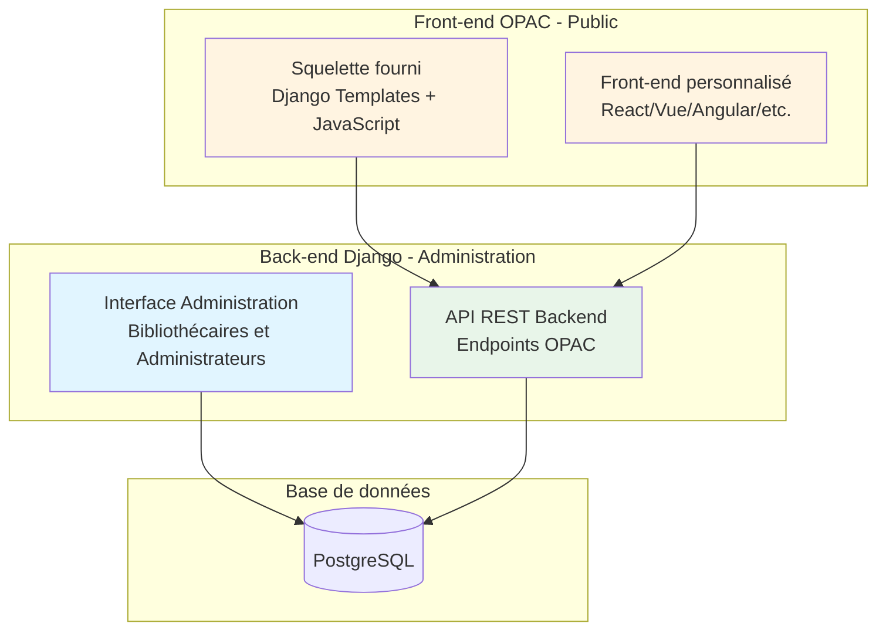
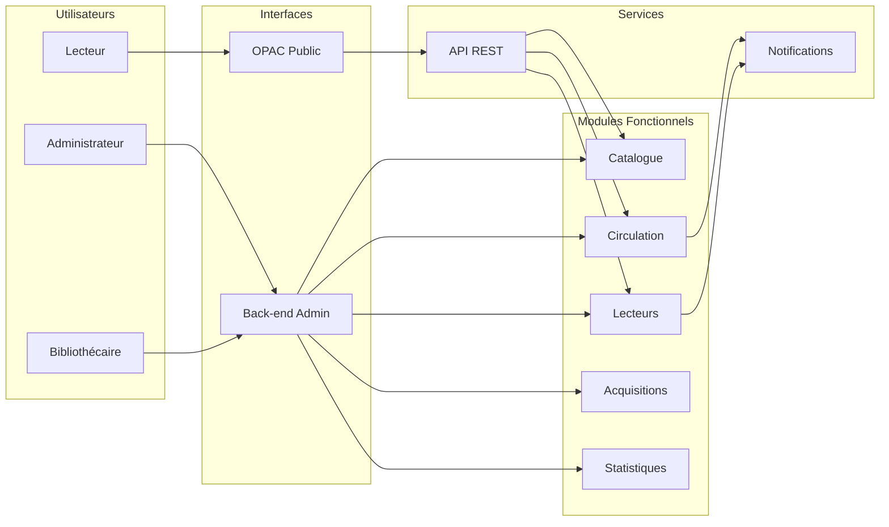
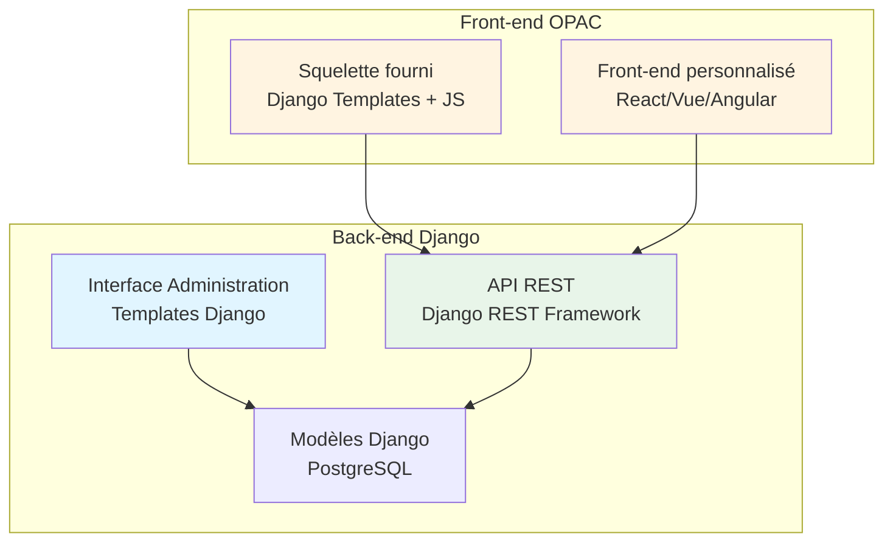

# MediaBib - Cahier des Charges

**Système Intégré de Gestion de Bibliothèque (SIGB) Open Source**

---

**Version** : 1.0  
**Date** : 2024  
**Type de document** : Note de cadrage et cahier des charges fonctionnel

---

## Table des matières

1. [Présentation du projet](#1-présentation-du-projet)
2. [Vue d'ensemble fonctionnelle](#2-vue-densemble-fonctionnelle)
3. [Fonctionnalités principales par module](#3-fonctionnalités-principales-par-module)
4. [Workflows utilisateurs détaillés](#4-workflows-utilisateurs-détaillés)
5. [Architecture technique simplifiée](#5-architecture-technique-simplifiée)
6. [Exemples concrets d'utilisation](#6-exemples-concrets-dutilisation)
7. [Contraintes et exigences](#7-contraintes-et-exigences)
8. [Planning et phases de développement](#8-planning-et-phases-de-développement)
9. [Glossaire](#9-glossaire)

---

## 1. Présentation du projet

### 1.1 Contexte

**MediaBib** est un Système Intégré de Gestion de Bibliothèque (SIGB) open source développé en Django, conçu spécifiquement pour les réseaux de lecture publique. Il s'agit d'un clone moderne de PMB, offrant toutes les fonctionnalités nécessaires à la gestion quotidienne d'une ou plusieurs bibliothèques.

### 1.2 Objectifs

MediaBib a pour objectifs de :

- **Centraliser la gestion** : Un seul système pour gérer le catalogue, les lecteurs, les prêts, les acquisitions et les statistiques
- **Faciliter le travail quotidien** : Interface intuitive pour les bibliothécaires, automatisant les tâches répétitives
- **Améliorer le service public** : Portail en ligne (OPAC) permettant aux lecteurs de rechercher, réserver et gérer leurs emprunts
- **Supporter les réseaux** : Gestion multi-sites avec transferts de documents entre bibliothèques
- **Respecter les normes** : Compatibilité UNIMARC, Z39.50, SRU/SRW, SIP2 pour l'interopérabilité
- **Garantir la conformité** : Respect du RGPD et accessibilité WCAG 2.1 AA

### 1.3 Public cible

MediaBib s'adresse à :

- **Bibliothèques publiques** : Médiathèques municipales, bibliothèques départementales
- **Réseaux de bibliothèques** : Gestion centralisée de plusieurs sites
- **Tout type de documents** : Livres, CD, DVD, revues, jeux vidéo, partitions, ressources numériques
- **Taille variable** : De quelques centaines à plus de 70 000 notices bibliographiques

### 1.4 Valeur ajoutée

**Pour les bibliothécaires** :
- Interface moderne et intuitive
- Automatisation des tâches répétitives (notifications, rappels)
- Statistiques en temps réel
- Gestion multi-sites simplifiée

**Pour les lecteurs** :
- Recherche facile dans le catalogue en ligne
- Réservation et prolongation de prêts depuis chez soi
- Notifications automatiques (email, SMS)
- Historique de leurs emprunts

**Pour les administrateurs** :
- Système open source (pas de licence)
- Personnalisable selon les besoins
- Conforme aux normes bibliothéconomiques
- Évolutif et maintenable

---

## 2. Vue d'ensemble fonctionnelle

### 2.1 Architecture générale

MediaBib est conçu avec une **architecture séparée** entre le back-end d'administration et le front-end public :



**Principe** :
- **Back-end** : Interface complète de gestion pour le personnel (catalogage, prêts, gestion lecteurs, etc.)
- **Front-end** : Portail public accessible aux visiteurs, communiquant uniquement via API REST
- **Séparation** : Le front-end peut être personnalisé ou remplacé par n'importe quelle technologie

### 2.2 Les 3 interfaces principales

MediaBib propose trois interfaces distinctes selon le profil utilisateur :

#### Interface Administrateur
- **Public** : Administrateurs système
- **Accès** : `/admin/` et modules de configuration
- **Fonctionnalités** : Configuration système, gestion utilisateurs, paramétrage multi-sites, statistiques globales

#### Interface Bibliothécaire
- **Public** : Bibliothécaires et personnel
- **Accès** : Modules fonctionnels (`/catalog/`, `/circulation/`, `/patrons/`, etc.)
- **Fonctionnalités** : Catalogage, prêts/retours, gestion lecteurs, acquisitions, rapports

#### Interface Lecteur (OPAC)
- **Public** : Lecteurs et visiteurs
- **Accès** : Portail public (OPAC)
- **Fonctionnalités** : Recherche catalogue, compte lecteur, réservations, prolongations, historique

### 2.3 Écosystème MediaBib



---

## 3. Fonctionnalités principales par module

### 3.1 Module Catalogue

**Description** : Gestion complète du catalogue bibliographique au format UNIMARC.

#### Fonctionnalités principales

**Création et gestion de notices** :
- Saisie manuelle de notices UNIMARC complètes
- Import depuis d'autres systèmes (PMB, fichiers UNIMARC)
- Recherche et récupération via Z39.50/SRU
- Duplication et fusion de notices
- Gestion des autorités (auteurs, éditeurs, sujets)

**Exemple concret** : Un bibliothécaire reçoit un nouveau livre "Le Petit Prince" d'Antoine de Saint-Exupéry. Il peut :
1. Rechercher si la notice existe déjà (via ISBN ou titre)
2. Si oui, ajouter simplement un exemplaire
3. Si non, créer une nouvelle notice UNIMARC avec tous les champs (titre, auteur, éditeur, ISBN, etc.)
4. Associer l'auteur à l'autorité "Saint-Exupéry, Antoine de"

**Import/Export depuis PMB** :
- Import de notices et exemplaires depuis PMB au format XML UNIMARC
- Sélection de la médiathèque cible dans MediaBib
- Détection automatique de doublons par ISBN
- Si notice existe déjà : ajout des exemplaires uniquement
- Si notice n'existe pas : création complète de la notice + exemplaires
- Export multi-formats (XML UNIMARC, CSV, JSON, ISO 2709)

**Exemple concret d'import PMB** : Un bibliothécaire veut importer le catalogue d'une médiathèque PMB vers MediaBib :
1. Il sélectionne le fichier XML UNIMARC exporté depuis PMB
2. Il choisit la médiathèque cible dans MediaBib (ex: "Site Central")
3. Le système parse le fichier et pour chaque notice :
   - Extrait l'ISBN (champ 010$a)
   - Recherche si une notice avec cet ISBN existe déjà
   - Si oui : ajoute seulement les exemplaires à la médiathèque cible
   - Si non : crée la notice complète avec tous les champs UNIMARC + exemplaires
4. Un rapport détaillé affiche : 150 notices créées, 320 exemplaires ajoutés, 45 notices existantes enrichies

**Cas d'usage** :
- Catalogage quotidien de nouveaux documents
- Import en masse depuis un autre SIGB (PMB, etc.)
- Migration complète depuis PMB vers MediaBib
- Enrichissement du catalogue via Z39.50
- Dédoublonnage et nettoyage du catalogue
- Export pour sauvegarde ou partage

**Bénéfices** :
- Catalogue structuré et normalisé (UNIMARC)
- Recherche efficace pour les bibliothécaires et lecteurs
- Interopérabilité avec d'autres systèmes
- Migration facilitée depuis PMB
- Gestion intelligente des doublons (évite les notices dupliquées)

### 3.2 Module Exemplaires

**Description** : Gestion physique des documents (cotes, localisations, états).

#### Fonctionnalités principales

**Gestion des exemplaires** :
- Création d'exemplaires rattachés à une notice
- Attribution de code-barres (génération automatique)
- Cotation et localisation (site, section, rayon)
- Gestion des statuts (disponible, prêté, en réparation, etc.)
- Historique des prêts par exemplaire

**Exemple concret** : Après avoir créé la notice "Le Petit Prince", le bibliothécaire :
1. Ajoute 3 exemplaires du livre
2. Chaque exemplaire reçoit un code-barres unique (ex: 1234567890123)
3. Les exemplaires sont localisés : "Site Central - Jeunesse - Rayon Contes"
4. Les exemplaires sont disponibles au prêt

**Cas d'usage** :
- Ajout d'exemplaires lors de l'acquisition
- Transfert d'exemplaires entre sites
- Gestion de l'état physique (neuf, bon, usé, à réparer)
- Inventaire annuel

**Bénéfices** :
- Traçabilité complète de chaque document physique
- Gestion multi-sites facilitée
- Optimisation de la répartition des exemplaires

### 3.3 Module Circulation (Prêts)

**Description** : Gestion complète des emprunts, retours, réservations et amendes.

#### Fonctionnalités principales

**Prêts et retours** :
- Prêt rapide via scan code-barres (carte lecteur + document)
- Vérification automatique des quotas et règles
- Calcul automatique des dates de retour
- Gestion des retours avec calcul d'amendes
- Prolongation de prêts (sur place ou en ligne)

**Réservations** :
- Réservation en ligne ou sur place
- File d'attente automatique
- Notification automatique de disponibilité
- Expiration automatique des réservations

**Amendes** :
- Calcul automatique selon les règles (retard, perte, dégradation)
- Gestion des paiements
- Historique des amendes

**Exemple concret - Prêt** :
1. Un lecteur se présente avec sa carte et un livre
2. Le bibliothécaire scanne la carte (lecteur identifié : "Marie Dupont")
3. Le bibliothécaire scanne le livre (exemplaire identifié : "Le Petit Prince - Ex. 1")
4. Le système vérifie :
   - Le lecteur a-t-il atteint son quota ? (ex: max 5 livres)
   - Le lecteur a-t-il des amendes impayées ?
   - Le document est-il disponible ?
5. Si tout est OK, le prêt est enregistré
6. Date de retour calculée automatiquement (ex: +21 jours)
7. Email de confirmation envoyé au lecteur

**Exemple concret - Retour avec amende** :
1. Un lecteur retourne un livre avec 5 jours de retard
2. Le bibliothécaire scanne le livre
3. Le système détecte le retard et calcule l'amende (ex: 0,50€ × 5 jours = 2,50€)
4. Le bibliothécaire informe le lecteur et enregistre le paiement
5. Le livre est remis en rayon ou mis de côté s'il est réservé

**Cas d'usage** :
- Gestion quotidienne des prêts/retours
- Réservations de documents populaires
- Gestion des retards et amendes
- Statistiques de prêts

**Bénéfices** :
- Rapidité dans le traitement des prêts (scan)
- Réduction des erreurs (vérifications automatiques)
- Meilleur service aux lecteurs (réservations, notifications)

### 3.4 Module Lecteurs

**Description** : Gestion complète des abonnés et de leurs comptes.

#### Fonctionnalités principales

**Inscription et gestion** :
- Inscription en ligne ou sur place
- Gestion des catégories (Enfant, Adulte, Senior, etc.)
- Gestion des abonnements (types, durées, renouvellements)
- Quotas de prêt par catégorie
- Historique complet des emprunts

**Exemple concret - Inscription** :
1. Un nouveau lecteur se présente avec sa pièce d'identité
2. Le bibliothécaire crée son compte :
   - Nom, prénom, adresse, email, téléphone
   - Date de naissance (pour déterminer la catégorie)
   - Type d'abonnement (ex: "Adulte - Annuel")
3. Le système génère automatiquement :
   - Un numéro de carte unique
   - Un code-barres pour la carte
   - Un compte OPAC (email + mot de passe temporaire)
4. Le lecteur peut immédiatement emprunter et accéder à son compte en ligne

**Cas d'usage** :
- Inscription de nouveaux lecteurs
- Renouvellement d'abonnements
- Modification de coordonnées
- Gestion des quotas et restrictions
- Consultation du dossier lecteur

**Bénéfices** :
- Dossier lecteur complet et centralisé
- Accès en ligne pour les lecteurs
- Gestion simplifiée des abonnements

### 3.5 Module OPAC (Portail Public)

**Description** : Catalogue public en ligne accessible aux visiteurs et lecteurs.

#### Fonctionnalités principales

**Recherche** :
- Recherche simple (mots-clés dans tous les champs)
- Recherche avancée (titre, auteur, ISBN, sujet, etc.)
- Filtres (type de document, disponibilité, site)
- Affichage des résultats avec disponibilité en temps réel

**Compte lecteur** :
- Connexion avec email/mot de passe
- Consultation des prêts en cours
- Historique des emprunts
- Réservations en ligne
- Prolongation de prêts
- Suggestions d'achat

**Exemple concret - Recherche et réservation** :
1. Un lecteur cherche "Harry Potter" sur l'OPAC
2. Il trouve plusieurs résultats avec disponibilité
3. Il clique sur "Harry Potter et la Chambre des Secrets"
4. Il voit : "3 exemplaires disponibles au Site Central"
5. Il clique sur "Réserver"
6. Il se connecte à son compte
7. La réservation est créée
8. Il reçoit un email de confirmation
9. Quand le livre devient disponible, il reçoit un email de notification

**Cas d'usage** :
- Recherche de documents avant de venir à la bibliothèque
- Réservation de documents populaires
- Consultation de son compte depuis chez soi
- Prolongation de prêts sans se déplacer

**Bénéfices** :
- Accessibilité 24/7 depuis n'importe où
- Réduction de la fréquentation physique (réservations en ligne)
- Meilleure visibilité du catalogue

### 3.6 Module Multi-sites

**Description** : Gestion d'un réseau de plusieurs bibliothèques.

#### Fonctionnalités principales

**Gestion des sites** :
- Configuration de plusieurs bibliothèques
- Gestion indépendante des collections par site
- Transferts de documents entre sites
- Statistiques par site

**Transferts inter-sites** :
- Navettes automatiques
- Suivi des transferts
- Notifications aux lecteurs

**Exemple concret - Transfert** :
1. Un lecteur du Site A réserve un livre disponible au Site B
2. Le système crée automatiquement une demande de transfert
3. Le bibliothécaire du Site B prépare le livre pour la navette
4. Le livre est transféré vers le Site A
5. Le lecteur est notifié que son livre est disponible
6. Le lecteur retire le livre au Site A

**Cas d'usage** :
- Réseaux de bibliothèques municipales
- Bibliothèques départementales avec antennes
- Partage de collections entre sites

**Bénéfices** :
- Mutualisation des collections
- Meilleur service aux lecteurs (accès à tous les documents du réseau)
- Gestion centralisée avec autonomie par site

### 3.7 Module Acquisitions

**Description** : Gestion des commandes, budgets et fournisseurs.

#### Fonctionnalités principales

**Commandes** :
- Création de commandes
- Sélection de fournisseurs
- Suivi des livraisons
- Réception et facturation

**Budgets** :
- Gestion des budgets par poste
- Suivi des dépenses
- Rapports budgétaires

**Exemple concret - Commande** :
1. Un bibliothécaire identifie 10 livres à commander
2. Il crée une commande dans le système
3. Il sélectionne un fournisseur (ex: "Librairie du Centre")
4. Il envoie le bon de commande
5. À la réception, il vérifie les livres reçus
6. Il enregistre la facture
7. Les notices sont créées automatiquement ou manuellement
8. Les exemplaires sont ajoutés et mis en rayon

**Cas d'usage** :
- Commandes régulières de nouveautés
- Gestion des budgets annuels
- Suivi des fournisseurs
- Suggestions d'achat des lecteurs

**Bénéfices** :
- Traçabilité complète des acquisitions
- Maîtrise des budgets
- Optimisation des commandes

### 3.8 Module Statistiques

**Description** : Tableaux de bord, rapports et analyses.

#### Fonctionnalités principales

**Statistiques en temps réel** :
- Nombre de prêts du jour/mois/année
- Documents les plus empruntés
- Taux de rotation
- Taux de fréquentation

**Rapports** :
- Rapports mensuels/annuels
- Exports Excel/CSV
- Graphiques et visualisations

**Exemple concret - Rapport mensuel** :
Un administrateur génère le rapport mensuel qui inclut :
- 1 250 prêts effectués
- 45 nouveaux lecteurs inscrits
- 120 réservations honorées
- 15 amendes collectées (total : 45€)
- Top 10 des documents les plus empruntés
- Répartition par site

**Cas d'usage** :
- Suivi de l'activité quotidienne
- Rapports pour la direction
- Analyse des collections
- Planification des acquisitions

**Bénéfices** :
- Pilotage basé sur les données
- Justification des budgets
- Optimisation des collections

---

## 4. Workflows utilisateurs détaillés

### 4.1 Workflow Administrateur

#### Installation initiale du système

**Scénario : Première installation de MediaBib**

**Étape 1 : Installation technique**
1. L'administrateur installe MediaBib selon les instructions
2. Il applique les migrations : `python manage.py migrate`
3. Il lance le serveur : `python manage.py runserver`
4. Il accède à l'application : http://localhost:8000

**Étape 2 : Détection de l'installation**
1. Le système détecte automatiquement qu'aucun superutilisateur n'existe
2. Redirection automatique vers `/setup/` (formulaire d'installation)
3. Message affiché : "Bienvenue dans MediaBib - Configuration initiale"

**Étape 3 : Formulaire de création du coordonnateur**
Le formulaire d'installation s'affiche avec les champs suivants :

1. **Informations personnelles** :
   - **Email** : `coordonnateur@bibliotheque.fr` (obligatoire)
     - Format email valide requis
     - Utilisé pour la connexion
   - **Nom** : `Dupont` (obligatoire)
   - **Prénom** : `Marie` (obligatoire)

2. **Informations réseau** (optionnel) :
   - **Nom du réseau** : `Réseau des Médiathèques de la Ville`
     - Utile si plusieurs bibliothèques dans le réseau
     - Peut être complété plus tard

3. **Sécurité** :
   - **Mot de passe** : (obligatoire, minimum 8 caractères)
   - **Confirmation du mot de passe** : (obligatoire)
   - Validation en temps réel de la force du mot de passe

4. **Conditions** :
   - Case à cocher : "J'accepte les conditions d'utilisation"

**Étape 4 : Création du compte**
1. L'administrateur remplit tous les champs obligatoires
2. Il vérifie que le mot de passe respecte les critères
3. Il accepte les conditions d'utilisation
4. Il clique sur "Créer le compte coordonnateur"

**Étape 5 : Post-installation**
1. Le système crée automatiquement :
   - Le compte superutilisateur avec tous les droits
   - L'enregistrement de configuration système avec les informations du réseau
   - Le flag `installation_complete` est activé
2. L'administrateur est automatiquement connecté
3. Redirection vers le tableau de bord administrateur
4. Message de bienvenue : "Installation terminée ! Vous pouvez maintenant configurer vos médiathèques."

**Étape 6 : Configuration des médiathèques**
1. Depuis le tableau de bord, l'administrateur clique sur "Ajouter une médiathèque"
2. Il renseigne les informations :
   - Nom : "Médiathèque Centrale"
   - Adresse complète
   - Téléphone, email
   - Horaires d'ouverture
3. Il peut ajouter plusieurs médiathèques si nécessaire
4. Il configure les sections et rayons de chaque médiathèque

**Étape 7 : Configuration système**
1. L'administrateur accède aux paramètres système
2. Il configure :
   - Les règles de prêt (durées, quotas)
   - Les tarifs d'amendes
   - Les catégories de lecteurs
   - Les types de documents
   - Les configurations email par médiathèque

**Résultat** : MediaBib est opérationnel avec le coordonnateur créé et les médiathèques configurées.

#### Connexion et configuration initiale (après installation)

**Étape 1 : Connexion normale**
1. L'administrateur accède à l'URL de MediaBib
2. Il clique sur "Connexion"
3. Il entre son email et mot de passe (créés lors de l'installation)
4. Il accède au tableau de bord d'administration

**Étape 2 : Configuration de base**
1. Configuration des paramètres système (nom de la bibliothèque, adresse, etc.)
2. Configuration des emails (serveur SMTP pour les notifications)
3. Configuration des règles de prêt (durées, quotas par catégorie)

#### Création d'utilisateurs et attribution de rôles

**Scénario : Créer un nouveau bibliothécaire**

1. **Accès au module utilisateurs**
   - Menu : Administration > Utilisateurs > Ajouter
   - Formulaire de création d'utilisateur

2. **Saisie des informations**
   - Nom d'utilisateur : `marie.martin`
   - Email : `marie.martin@bibliotheque.fr`
   - Mot de passe : Généré automatiquement ou défini manuellement
   - Statut : "Personnel" (staff)

3. **Attribution des permissions**
   - Groupe : "Bibliothécaire" (permissions prédéfinies)
   - Ou permissions personnalisées :
     - `catalog.add_bibliographicrecord` (créer des notices)
     - `circulation.add_loan` (effectuer des prêts)
     - `patrons.view_reader` (consulter les lecteurs)

4. **Enregistrement**
   - L'utilisateur reçoit un email avec ses identifiants
   - Il peut se connecter immédiatement

#### Configuration multi-sites

**Scénario : Créer un nouveau site bibliothèque**

1. **Accès au module sites**
   - Menu : Sites > Bibliothèques > Ajouter

2. **Saisie des informations du site**
   - Nom : "Bibliothèque Centrale"
   - Code : "BC"
   - Adresse : "10 Rue de la République, 75001 Paris"
   - Téléphone : "01 23 45 67 89"
   - Email : "contact@bibliotheque.fr"
   - Horaires d'ouverture

3. **Configuration des paramètres spécifiques**
   - Quotas de prêt spécifiques au site
   - Règles de transfert
   - Configuration email spécifique (si nécessaire)

4. **Enregistrement**
   - Le site apparaît dans la liste
   - Les exemplaires peuvent être assignés à ce site

#### Configuration des quotas et règles de prêt

**Scénario : Définir les règles de prêt pour les enfants**

1. **Accès au module quotas**
   - Menu : Lecteurs > Catégories > Enfant > Modifier

2. **Configuration des quotas**
   - Nombre maximum de prêts : 5 documents
   - Durée de prêt : 21 jours
   - Types de documents autorisés :
     - Livres : Oui (max 5)
     - CD : Oui (max 2)
     - DVD : Non
     - Jeux vidéo : Non

3. **Règles spéciales**
   - Prolongation autorisée : Oui (1 fois)
   - Amende en cas de retard : 0,20€/jour
   - Blocage après 3 retards : Oui

4. **Enregistrement**
   - Les règles s'appliquent automatiquement à tous les lecteurs de la catégorie "Enfant"

### 4.2 Workflow Bibliothécaire

#### Connexion

1. Le bibliothécaire accède à l'URL de MediaBib
2. Il clique sur "Connexion"
3. Il entre son identifiant et mot de passe
4. Il est redirigé vers le tableau de bord

#### Catalogage d'un nouveau document

**Scénario complet : Cataloguer "Le Petit Prince" d'Antoine de Saint-Exupéry**

**Étape 1 : Recherche de la notice existante**
1. Menu : Catalogue > Rechercher
2. Recherche par ISBN : `9782070612758`
3. Résultat : Aucune notice trouvée

**Étape 2 : Création de la notice**
1. Menu : Catalogue > Nouvelle notice
2. Sélection du type de document : "Livre"
3. Saisie des champs UNIMARC :
   - **Zone 200** (Titre) : "Le Petit Prince"
   - **Zone 700** (Auteur) : "Saint-Exupéry, Antoine de"
   - **Zone 010** (ISBN) : "9782070612758"
   - **Zone 210** (Édition) : "Paris : Gallimard, 2017"
   - **Zone 215** (Description) : "93 p. : ill. ; 19 cm"
   - **Zone 686** (Classification) : "843.912"
   - **Zone 606** (Sujet) : "Conte"

4. Enregistrement de la notice

**Étape 3 : Création de l'autorité auteur**
1. Le système détecte que l'auteur n'existe pas dans les autorités
2. Création automatique de l'autorité "Saint-Exupéry, Antoine de"
3. Lien automatique entre la notice et l'autorité

**Étape 4 : Ajout des exemplaires**
1. Depuis la notice, clic sur "Ajouter un exemplaire"
2. Pour chaque exemplaire :
   - Code-barres : Généré automatiquement (ex: `1234567890123`)
   - Localisation : "Site Central - Jeunesse - Rayon Contes"
   - Cote : "J CON SAI"
   - État : "Neuf"
   - Prix : "6,90 €"
3. Ajout de 3 exemplaires

**Étape 5 : Finalisation**
1. Impression des étiquettes code-barres
2. Impression des cotes
3. Mise en rayon
4. Les exemplaires sont maintenant disponibles au prêt

**Temps estimé** : 5-10 minutes pour une notice complète

#### Prêt d'un document

**Scénario : Prêter un livre à un lecteur**

**Étape 1 : Accès au module prêt**
1. Menu : Circulation > Prêt
2. Interface de prêt rapide s'affiche

**Étape 2 : Identification du lecteur**
1. Scan de la carte lecteur (ou saisie du numéro)
2. Affichage des informations du lecteur :
   - Nom : "Marie Dupont"
   - Catégorie : "Adulte"
   - Prêts en cours : 3/5
   - Amendes : 0,00 €
   - Statut : "Actif"

**Étape 3 : Vérifications automatiques**
Le système vérifie :
- ✅ Le lecteur n'a pas atteint son quota (3/5)
- ✅ Aucune amende impayée
- ✅ L'abonnement est valide

**Étape 4 : Scan du document**
1. Scan du code-barres du livre
2. Affichage des informations :
   - Titre : "Le Petit Prince"
   - Exemplaire : "Ex. 1"
   - Disponibilité : "Disponible"

**Étape 5 : Enregistrement du prêt**
1. Le système enregistre automatiquement :
   - Lecteur : Marie Dupont
   - Document : Le Petit Prince - Ex. 1
   - Date de prêt : 15/12/2024
   - Date de retour prévue : 05/01/2025 (21 jours)
2. Mise à jour du statut de l'exemplaire : "Prêté"
3. Mise à jour du compteur de prêts du lecteur : 4/5

**Étape 6 : Confirmation**
1. Impression automatique du ticket de prêt
2. Email de confirmation envoyé au lecteur
3. Le bibliothécaire remet le livre et le ticket au lecteur

**Temps estimé** : 30 secondes par prêt

#### Retour d'un document avec amende

**Scénario : Retour d'un livre en retard**

**Étape 1 : Accès au module retour**
1. Menu : Circulation > Retour
2. Interface de retour s'affiche

**Étape 2 : Scan du document**
1. Scan du code-barres du livre retourné
2. Affichage des informations :
   - Titre : "Le Petit Prince"
   - Lecteur : "Marie Dupont"
   - Date de prêt : 15/12/2024
   - Date de retour prévue : 05/01/2025
   - Date de retour effective : 10/01/2025
   - **Retard : 5 jours**

**Étape 3 : Calcul de l'amende**
Le système calcule automatiquement :
- Tarif : 0,50 €/jour
- Jours de retard : 5
- **Amende totale : 2,50 €**

**Étape 4 : Gestion de l'amende**
1. Le bibliothécaire informe le lecteur
2. Options :
   - Paiement immédiat (espèces, carte)
   - Report du paiement (amende ajoutée au compte)
3. Si paiement immédiat :
   - Enregistrement du paiement
   - Impression d'un reçu
4. Si report :
   - L'amende reste sur le compte
   - Le lecteur ne pourra plus emprunter tant qu'elle n'est pas payée

**Étape 5 : Traitement du retour**
1. Le système enregistre le retour
2. Vérification des réservations :
   - Si le livre est réservé : Mise de côté
   - Si non : Remise en rayon
3. Mise à jour du statut de l'exemplaire : "Disponible"
4. Mise à jour du compteur de prêts du lecteur : 3/5

**Temps estimé** : 1-2 minutes (selon le paiement)

#### Gestion des réservations

**Scénario : Un livre réservé devient disponible**

**Étape 1 : Consultation des réservations**
1. Menu : Circulation > Réservations
2. Liste des réservations en attente

**Étape 2 : Notification de disponibilité**
1. Un livre réservé est retourné
2. Le système identifie automatiquement la première personne dans la file d'attente
3. Email automatique envoyé : "Votre réservation est disponible"
4. Délai de retrait : 7 jours

**Étape 3 : Retrait de la réservation**
1. Le lecteur se présente avec sa carte
2. Le bibliothécaire scanne la carte
3. Affichage : "1 réservation disponible"
4. Le bibliothécaire scanne le livre mis de côté
5. Le système enregistre le prêt
6. La réservation est automatiquement annulée

**Temps estimé** : 30 secondes

#### Journée type d'un bibliothécaire

**Matin (9h-12h)**
- 9h00 : Connexion, consultation des statistiques de la veille
- 9h15 : Traitement des retours (10 documents)
- 10h00 : Prêts (15 documents)
- 10h30 : Catalogage de 3 nouveaux livres reçus
- 11h00 : Gestion des réservations (mise de côté de 5 livres)
- 11h30 : Accueil de nouveaux lecteurs (2 inscriptions)

**Après-midi (14h-17h)**
- 14h00 : Prêts (20 documents)
- 14h30 : Retours (12 documents, dont 2 avec amendes)
- 15h00 : Recherche dans le catalogue pour répondre aux questions
- 15h30 : Mise à jour de notices (ajout de résumés)
- 16h00 : Préparation des navettes inter-sites (5 documents)
- 16h30 : Consultation des statistiques du jour

**Total** : ~50 prêts/retours, 3 notices cataloguées, 2 nouveaux lecteurs

#### Import de notices depuis PMB

**Scénario : Importer le catalogue d'une médiathèque PMB vers MediaBib**

**Étape 1 : Préparation du fichier**
1. Le bibliothécaire exporte le catalogue depuis PMB au format XML UNIMARC
2. Le fichier contient toutes les notices et leurs exemplaires associés
3. Le fichier est sauvegardé localement (ex: `catalogue_pmb_2024.xml`)

**Étape 2 : Accès au module d'import**
1. Menu : Catalogue > Import/Export > Import PMB
2. Interface d'import s'affiche avec :
   - Sélection du fichier XML
   - Choix de la médiathèque cible (liste déroulante)
   - Options d'import (gestion des doublons, etc.)

**Étape 3 : Configuration de l'import**
1. **Sélection du fichier** : Clic sur "Parcourir" et sélection du fichier XML UNIMARC
2. **Sélection de la médiathèque cible** : 
   - Liste déroulante avec toutes les médiathèques MediaBib
   - Exemple : "Site Central", "Site Nord", "Site Sud"
   - Sélection : "Site Central"
3. **Options d'import** :
   - Gestion des doublons : "Détection par ISBN" (activé par défaut)
   - Conservation des codes-barres PMB : Oui
   - Génération automatique si absent : Oui
   - Mode : "Import complet" (notices + exemplaires)

**Étape 4 : Lancement de l'import**
1. Clic sur "Lancer l'import"
2. Le système affiche une barre de progression
3. Traitement en arrière-plan :
   - Parsing du fichier XML UNIMARC
   - Pour chaque notice :
     - Extraction de l'ISBN (champ 010$a)
     - Recherche dans MediaBib : existe-t-il une notice avec cet ISBN ?
     - **Si notice existe** :
       - Récupération de la notice existante
       - Ajout des exemplaires PMB à cette notice
       - Rattachement des exemplaires à la médiathèque cible
     - **Si notice n'existe pas** :
       - Création de la notice complète avec tous les champs UNIMARC
       - Création des autorités associées (auteurs, éditeurs, etc.)
       - Création des exemplaires avec leurs codes-barres
       - Rattachement à la médiathèque cible

**Étape 5 : Rapport d'import**
1. Une fois l'import terminé, affichage du rapport détaillé :
   ```
   Import terminé avec succès
   
   Statistiques :
   - Notices traitées : 500
   - Notices créées : 380
   - Notices existantes enrichies : 120
   - Exemplaires ajoutés : 850
   - Autorités créées : 250
   - Erreurs : 5 (voir détails)
   
   Détails des erreurs :
   - Notice #123 : ISBN invalide
   - Notice #456 : Champs UNIMARC manquants
   - ...
   ```
2. Possibilité d'exporter le rapport en PDF ou CSV
3. Possibilité de relancer l'import pour les notices en erreur

**Étape 6 : Vérification**
1. Le bibliothécaire vérifie quelques notices importées
2. Consultation d'une notice créée : tous les champs UNIMARC sont présents
3. Consultation des exemplaires : codes-barres conservés, rattachés à "Site Central"
4. Vérification d'une notice existante enrichie : exemplaires supplémentaires ajoutés

**Temps estimé** : 
- Import de 500 notices : 5-10 minutes (selon la taille du fichier)
- Vérification : 10-15 minutes

**Cas d'usage** :
- Migration complète depuis PMB vers MediaBib
- Import de nouvelles acquisitions depuis PMB
- Synchronisation de catalogues entre systèmes
- Consolidation de catalogues de plusieurs médiathèques PMB

### 4.3 Workflow Lecteur

#### Inscription en ligne

**Scénario : Un nouveau lecteur s'inscrit sur l'OPAC**

**Étape 1 : Accès à l'inscription**
1. Le lecteur accède à l'OPAC
2. Clic sur "S'inscrire" ou "Devenir lecteur"

**Étape 2 : Formulaire d'inscription**
1. Saisie des informations :
   - Nom, prénom
   - Adresse complète
   - Email
   - Téléphone
   - Date de naissance
   - Pièce d'identité (upload)

2. Acceptation des conditions générales

**Étape 3 : Validation**
1. Le système vérifie les informations
2. Création automatique du compte
3. Email de confirmation avec identifiants temporaires
4. **Important** : Le compte doit être validé par un bibliothécaire avant le premier prêt

**Étape 4 : Validation par le bibliothécaire**
1. Le bibliothécaire reçoit une notification
2. Il vérifie la pièce d'identité
3. Il valide le compte dans le système
4. Le lecteur peut maintenant emprunter

#### Recherche dans le catalogue OPAC

**Scénario : Rechercher un livre sur l'OPAC**

**Étape 1 : Accès à la recherche**
1. Le lecteur accède à l'OPAC
2. Barre de recherche visible sur la page d'accueil

**Étape 2 : Recherche simple**
1. Saisie : "Harry Potter"
2. Clic sur "Rechercher" ou appui sur Entrée
3. Affichage des résultats :
   - "Harry Potter et la Pierre philosophale" - 2 exemplaires disponibles
   - "Harry Potter et la Chambre des Secrets" - 1 exemplaire disponible, 3 prêtés
   - "Harry Potter et le Prisonnier d'Azkaban" - 0 disponible, tous prêtés

**Étape 3 : Affinement de la recherche**
1. Filtres disponibles :
   - Type de document : Livre, CD, DVD
   - Disponibilité : Disponible maintenant
   - Site : Site Central, Site Nord, etc.
2. Le lecteur filtre : "Disponible maintenant"
3. Résultats affinés : 2 livres disponibles

**Étape 4 : Consultation d'une notice**
1. Clic sur "Harry Potter et la Pierre philosophale"
2. Affichage détaillé :
   - Titre, auteur, éditeur
   - Résumé
   - Disponibilité par site
   - Localisation (rayon)
3. Options :
   - Réserver
   - Ajouter au panier
   - Partager

#### Réservation en ligne

**Scénario : Réserver un livre depuis l'OPAC**

**Étape 1 : Connexion**
1. Le lecteur clique sur "Réserver"
2. Redirection vers la page de connexion
3. Saisie de l'email et du mot de passe
4. Connexion réussie

**Étape 2 : Création de la réservation**
1. Le système vérifie :
   - Le lecteur n'a pas déjà réservé ce document
   - Le lecteur n'a pas atteint son quota de réservations
2. Sélection du site de retrait : "Site Central"
3. Clic sur "Confirmer la réservation"

**Étape 3 : Confirmation**
1. Message : "Votre réservation a été enregistrée"
2. Email de confirmation envoyé
3. Position dans la file d'attente affichée (ex: "Vous êtes le 3ème sur la liste")

**Étape 4 : Notification de disponibilité**
1. Quand le livre devient disponible, le lecteur reçoit un email
2. Délai de retrait : 7 jours
3. Le livre est mis de côté à la bibliothèque

#### Consultation de son compte

**Scénario : Un lecteur consulte ses prêts en cours**

**Étape 1 : Connexion**
1. Le lecteur se connecte à son compte OPAC
2. Accès au tableau de bord

**Étape 2 : Consultation des prêts en cours**
Affichage de la liste :
- "Le Petit Prince" - Retour prévu le 05/01/2025 (5 jours restants)
- "Harry Potter et la Pierre philosophale" - Retour prévu le 10/01/2025 (10 jours restants)
- "Astérix et Obélix" - **En retard depuis 2 jours** (amende : 1,00 €)

**Étape 3 : Actions disponibles**
Pour chaque prêt :
- **Prolonger** : Si autorisé et pas de réservation
- **Voir les détails** : Date de prêt, date de retour, exemplaire

**Étape 4 : Prolongation**
1. Le lecteur clique sur "Prolonger" pour "Le Petit Prince"
2. Le système vérifie :
   - Pas de réservation sur ce document
   - Prolongation autorisée (1 fois)
   - Pas de retard
3. Nouvelle date de retour : 26/01/2025
4. Email de confirmation

#### Historique des emprunts

**Scénario : Consulter l'historique**

1. Menu : "Mon compte" > "Historique"
2. Affichage de tous les emprunts passés :
   - Livres empruntés dans les 12 derniers mois
   - Dates de prêt et retour
   - Possibilité d'exporter en PDF

**Exemple d'utilisation** : Un lecteur veut se souvenir des livres qu'il a lus pour faire une recommandation à un ami.

#### Un lecteur réserve un livre - Scénario complet

**Contexte** : Marie, lectrice régulière, veut lire "Le Seigneur des Anneaux" mais tous les exemplaires sont prêtés.

**Jour 1 - Réservation**
1. Marie cherche "Le Seigneur des Anneaux" sur l'OPAC
2. Résultat : "0 disponible, 5 prêtés"
3. Elle clique sur "Réserver"
4. Elle se connecte à son compte
5. Elle sélectionne le site de retrait : "Site Central"
6. Réservation créée, position : "Vous êtes le 2ème sur la liste"

**Jour 5 - Notification**
1. Un exemplaire est retourné
2. Le système envoie un email au premier lecteur de la file
3. Marie reste en 2ème position

**Jour 8 - Disponibilité**
1. Le premier lecteur retire le livre
2. Un autre exemplaire est retourné
3. Le système envoie un email à Marie : "Votre réservation est disponible"
4. Délai de retrait : 7 jours

**Jour 10 - Retrait**
1. Marie se rend à la bibliothèque
2. Elle présente sa carte au bibliothécaire
3. Le bibliothécaire scanne la carte
4. Affichage : "1 réservation disponible"
5. Le bibliothécaire récupère le livre mis de côté
6. Scan du livre
7. Prêt enregistré automatiquement
8. Marie repart avec son livre

**Total** : 10 jours entre la réservation et le retrait

---

## 5. Architecture technique simplifiée

### 5.1 Stack technique

MediaBib est développé avec des technologies modernes et éprouvées :

| Composant | Technologie | Version | Rôle |
|-----------|-------------|---------|------|
| **Framework** | Django | 5.2+ | Framework web Python |
| **Langage** | Python | 3.10+ | Langage de programmation |
| **Base de données** | PostgreSQL | 14+ | Stockage des données (production) |
| **Cache** | Redis | 7+ | Cache et sessions |
| **Tâches async** | Celery | 5.3+ | Traitement asynchrone (emails, etc.) |
| **Serveur WSGI** | Gunicorn | 21+ | Serveur d'application |
| **Reverse Proxy** | Nginx | - | Serveur web et SSL |
| **API** | Django REST Framework | 3.14+ | API REST pour l'OPAC |

### 5.2 Architecture Back-end / Front-end séparée

MediaBib utilise une architecture moderne séparant le back-end d'administration du front-end public :



**Avantages** :
- **Sécurité** : Séparation des accès (admin vs public)
- **Flexibilité** : Le front-end peut être personnalisé ou remplacé
- **Performance** : Optimisation indépendante de chaque partie
- **Évolutivité** : Développement et déploiement indépendants

### 5.3 Les 14 applications Django

MediaBib est organisé en **14 applications Django**, chacune responsable d'un domaine fonctionnel :

| Application | Rôle | Exemple |
|-------------|------|---------|
| **core** | Administration système | Créer un utilisateur |
| **sites** | Gestion multi-sites | Configurer 3 bibliothèques |
| **catalog** | Notices bibliographiques | Créer une notice UNIMARC |
| **items** | Exemplaires physiques | Ajouter 5 exemplaires |
| **patrons** | Lecteurs et abonnements | Inscrire un nouveau lecteur |
| **circulation** | Prêts et retours | Prêter un livre |
| **acquisitions** | Commandes et budgets | Commander 10 livres |
| **serials** | Périodiques | Gérer l'abonnement au "Monde" |
| **opac** | API REST publique | Rechercher via l'API |
| **rfid** | Automates de prêt | Scanner avec automate |
| **digital** | Ressources numériques | Ajouter un e-book |
| **events** | Animations | Créer un événement |
| **reports** | Statistiques | Générer un rapport |
| **notifications** | Emails/SMS | Envoyer un rappel |

**Principe modulaire** : Chaque application est indépendante mais peut communiquer avec les autres via les modèles Django.

### 5.4 Sécurité et conformité

#### Sécurité

- **Authentification** : Sessions Django sécurisées (back-end) et JWT (front-end)
- **Autorisation** : Permissions granulaires par module et action
- **Chiffrement** : HTTPS obligatoire en production
- **Protection CSRF** : Protection contre les attaques CSRF
- **Validation** : Validation stricte de toutes les entrées utilisateur
- **Audit** : Traçabilité complète de toutes les actions

#### Conformité RGPD

- **Consentement** : Gestion du consentement pour les données personnelles
- **Droit à l'oubli** : Suppression des données sur demande
- **Portabilité** : Export des données personnelles
- **Accès** : Consultation des données personnelles
- **Chiffrement** : Mots de passe et données sensibles chiffrés

#### Accessibilité WCAG 2.1 AA

- **Navigation clavier** : Tous les éléments accessibles au clavier
- **Lecteurs d'écran** : Compatible avec NVDA, JAWS, VoiceOver
- **Contraste** : Contraste minimum 4,5:1 pour le texte
- **ARIA** : Attributs ARIA pour l'accessibilité
- **Structure** : Balises sémantiques HTML5

---

## 6. Exemples concrets d'utilisation

### Scénario 1 : Une bibliothèque reçoit un nouveau livre

**Contexte** : La bibliothèque reçoit 3 exemplaires du livre "Le Petit Prince" d'Antoine de Saint-Exupéry.

**Étape 1 : Réception**
1. Le bibliothécaire reçoit les 3 livres du fournisseur
2. Il vérifie la facture et les livres
3. Il enregistre la réception dans le module Acquisitions

**Étape 2 : Catalogage**
1. Le bibliothécaire recherche si la notice existe déjà (via ISBN)
2. Si non, il crée une nouvelle notice UNIMARC :
   - Titre : "Le Petit Prince"
   - Auteur : "Saint-Exupéry, Antoine de"
   - ISBN : "9782070612758"
   - Éditeur : "Gallimard"
   - Classification : "843.912"
3. Il crée l'autorité auteur si nécessaire

**Étape 3 : Ajout des exemplaires**
1. Pour chaque exemplaire (3 au total) :
   - Génération d'un code-barres unique
   - Attribution d'une cote : "J CON SAI"
   - Localisation : "Site Central - Jeunesse - Rayon Contes"
   - État : "Neuf"
   - Prix : "6,90 €"
2. Les 3 exemplaires sont créés et rattachés à la notice

**Étape 4 : Équipement**
1. Impression des étiquettes code-barres (3 exemplaires)
2. Impression des cotes (3 exemplaires)
3. Collage des étiquettes sur les livres
4. Mise en rayon selon la localisation

**Étape 5 : Disponibilité**
1. Les exemplaires sont automatiquement marqués comme "Disponibles"
2. Ils apparaissent dans le catalogue OPAC
3. Les lecteurs peuvent les rechercher et les réserver

**Résultat** : Les 3 exemplaires sont disponibles au prêt en moins de 15 minutes.

### Scénario 2 : Un lecteur emprunte un document

**Contexte** : Marie, lectrice régulière, veut emprunter "Le Petit Prince".

**Étape 1 : Recherche OPAC**
1. Marie accède à l'OPAC depuis chez elle
2. Elle recherche "Le Petit Prince"
3. Elle trouve le livre avec disponibilité : "3 exemplaires disponibles au Site Central"
4. Elle décide de venir à la bibliothèque (pas de réservation nécessaire)

**Étape 2 : Prêt sur place**
1. Marie se présente à la bibliothèque avec sa carte
2. Le bibliothécaire scanne la carte de Marie
3. Affichage : "Marie Dupont - 2 prêts en cours / 5 max - Aucune amende"
4. Le bibliothécaire scanne le livre "Le Petit Prince"
5. Le système vérifie :
   - Quota OK (2/5)
   - Aucune amende
   - Document disponible
6. Prêt enregistré automatiquement
7. Date de retour : Dans 21 jours
8. Ticket imprimé et remis à Marie
9. Email de confirmation envoyé

**Étape 3 : Consultation du compte**
1. Le soir, Marie consulte son compte OPAC
2. Elle voit "Le Petit Prince" dans ses prêts en cours
3. Date de retour affichée : "05/01/2025"

**Étape 4 : Retour (21 jours plus tard)**
1. Marie retourne le livre à la bibliothèque
2. Le bibliothécaire scanne le livre
3. Le système identifie le prêt et enregistre le retour
4. Le livre est remis en rayon
5. Le prêt est archivé dans l'historique de Marie

**Résultat** : Prêt et retour traités en moins d'une minute chacun.

### Scénario 3 : Gestion multi-sites

**Contexte** : Un réseau de 3 bibliothèques (Site Central, Site Nord, Site Sud). Un lecteur du Site Nord veut un livre disponible uniquement au Site Central.

**Étape 1 : Réservation**
1. Le lecteur recherche "Harry Potter" sur l'OPAC
2. Résultat : "1 exemplaire disponible au Site Central"
3. Le lecteur réserve le livre
4. Site de retrait sélectionné : "Site Nord" (son site habituel)

**Étape 2 : Transfert automatique**
1. Le système crée automatiquement une demande de transfert
2. Notification au bibliothécaire du Site Central : "Livre à transférer vers Site Nord"
3. Le bibliothécaire du Site Central prépare le livre pour la navette
4. Il scanne le livre et sélectionne "Transfert vers Site Nord"
5. Le statut de l'exemplaire passe à "En transfert"

**Étape 3 : Réception au Site Nord**
1. Le livre arrive au Site Nord via la navette
2. Le bibliothécaire du Site Nord scanne le livre
3. Le système enregistre la réception
4. Le statut passe à "Réservé - Disponible au retrait"
5. Le lecteur est notifié par email : "Votre réservation est disponible au Site Nord"

**Étape 4 : Retrait**
1. Le lecteur se présente au Site Nord
2. Le bibliothécaire scanne sa carte
3. Affichage : "1 réservation disponible"
4. Le bibliothécaire récupère le livre mis de côté
5. Scan du livre et enregistrement du prêt
6. Le lecteur repart avec son livre

**Résultat** : Le lecteur a pu réserver et retirer le livre à son site habituel, même s'il était disponible ailleurs.

### Scénario 4 : Gestion d'une amende

**Contexte** : Un lecteur retourne un livre avec 10 jours de retard.

**Étape 1 : Retour en retard**
1. Le bibliothécaire scanne le livre retourné
2. Le système détecte le retard :
   - Date de retour prévue : 05/01/2025
   - Date de retour effective : 15/01/2025
   - Retard : 10 jours
3. Calcul automatique de l'amende :
   - Tarif : 0,50 €/jour
   - Amende : 10 × 0,50 € = 5,00 €

**Étape 2 : Information du lecteur**
1. Le bibliothécaire informe le lecteur de l'amende
2. Affichage : "Amende de 5,00 € à régler"

**Étape 3 : Paiement**
1. Le lecteur paie en espèces
2. Le bibliothécaire enregistre le paiement dans le système
3. Impression d'un reçu
4. L'amende est marquée comme "Payée"

**Étape 4 : Traitement du retour**
1. Le système enregistre le retour
2. Le livre est remis en rayon (pas de réservation)
3. Le prêt est archivé

**Alternative - Report du paiement** :
Si le lecteur ne peut pas payer immédiatement :
1. L'amende reste sur son compte
2. Le système bloque les nouveaux prêts tant que l'amende n'est pas payée
3. Le lecteur peut payer plus tard (en ligne ou sur place)

**Résultat** : Gestion transparente et automatique des amendes.

### Scénario 5 : Migration depuis PMB

**Contexte** : Une médiathèque utilise PMB et souhaite migrer vers MediaBib. Elle a un catalogue de 5000 notices avec 12000 exemplaires répartis sur 3 sites.

**Étape 1 : Préparation de l'export PMB**
1. L'administrateur PMB exporte le catalogue complet au format XML UNIMARC
2. Le fichier généré contient :
   - Toutes les notices bibliographiques (5000)
   - Tous les exemplaires avec leurs codes-barres
   - Les autorités (auteurs, éditeurs, sujets)
   - Les informations de localisation par site
3. Taille du fichier : ~150 Mo
4. Le fichier est sauvegardé : `catalogue_pmb_complet_2024.xml`

**Étape 2 : Configuration MediaBib**
1. L'administrateur MediaBib crée les 3 médiathèques correspondantes :
   - "Site Central" (médiathèque principale PMB)
   - "Site Nord" (antenne PMB)
   - "Site Sud" (antenne PMB)
2. Configuration des sections et rayons identiques à PMB

**Étape 3 : Import par site**
Pour chaque site, import séparé :

**Import Site Central** :
1. Menu : Catalogue > Import/Export > Import PMB
2. Sélection du fichier XML
3. Sélection médiathèque cible : "Site Central"
4. Filtrage des notices du Site Central (si le fichier contient tous les sites)
5. Lancement de l'import
6. Traitement : 2000 notices, 5000 exemplaires
7. Résultat :
   - 1800 notices créées (nouvelles)
   - 200 notices existantes enrichies (doublons détectés par ISBN)
   - 5000 exemplaires ajoutés au Site Central

**Import Site Nord** :
1. Même processus pour "Site Nord"
2. Résultat : 1500 notices créées, 3500 exemplaires ajoutés

**Import Site Sud** :
1. Même processus pour "Site Sud"
2. Résultat : 1500 notices créées, 3500 exemplaires ajoutés

**Étape 4 : Vérification et correction**
1. Consultation du rapport global d'import :
   ```
   Import complet terminé
   
   Site Central :
   - Notices créées : 1800
   - Notices enrichies : 200
   - Exemplaires : 5000
   
   Site Nord :
   - Notices créées : 1500
   - Notices enrichies : 50
   - Exemplaires : 3500
   
   Site Sud :
   - Notices créées : 1500
   - Notices enrichies : 50
   - Exemplaires : 3500
   
   Total :
   - Notices créées : 4800
   - Notices enrichies : 300
   - Exemplaires : 12000
   - Erreurs : 15 (ISBN invalides, champs manquants)
   ```
2. Traitement des erreurs :
   - Consultation des 15 notices en erreur
   - Correction manuelle des champs manquants
   - Réimport des notices corrigées

**Étape 5 : Vérification de la migration**
1. Vérification de quelques notices :
   - Tous les champs UNIMARC sont présents
   - Les autorités sont correctement liées
   - Les exemplaires ont conservé leurs codes-barres PMB
   - Les localisations sont correctes
2. Test de recherche : Recherche de titres connus → Résultats identiques à PMB
3. Vérification des exemplaires : Codes-barres scannables, statuts corrects

**Étape 6 : Export de sauvegarde**
1. Export complet du catalogue MediaBib au format XML UNIMARC
2. Sauvegarde pour archivage et vérification
3. Comparaison avec l'export PMB original : Cohérence vérifiée

**Résultat** : Migration complète réussie en 2 jours :
- Jour 1 : Exports PMB et imports MediaBib (6 heures)
- Jour 2 : Vérifications et corrections (4 heures)
- Catalogue opérationnel dans MediaBib avec toutes les données PMB

**Bénéfices de la migration** :
- Conservation de tous les codes-barres existants
- Pas de perte de données (tous les champs UNIMARC conservés)
- Gestion intelligente des doublons (évite les notices dupliquées)
- Migration par site facilitée
- Possibilité de migration progressive (site par site)

---

## 7. Contraintes et exigences

### 7.1 Normes supportées

MediaBib respecte les normes bibliothéconomiques internationales :

| Norme | Description | Usage |
|-------|-------------|-------|
| **UNIMARC** | Format de notices bibliographiques | Catalogage, import/export |
| **ISO 2709** | Format d'échange de notices | Import depuis autres SIGB |
| **Z39.50** | Protocole de recherche fédérée | Récupération de notices externes |
| **SRU/SRW** | API de recherche web | Recherche dans catalogues distants |
| **SIP2** | Communication avec automates | Automates de prêt/retour RFID |
| **NCIP** | Interopérabilité entre systèmes | Échange avec autres ILS |

### 7.2 Accessibilité WCAG 2.1 AA

MediaBib est conforme au niveau AA des Web Content Accessibility Guidelines :

- **Navigation clavier** : Tous les éléments accessibles via Tab
- **Lecteurs d'écran** : Compatible NVDA, JAWS, VoiceOver
- **Contraste** : Minimum 4,5:1 pour le texte normal
- **ARIA** : Attributs ARIA pour l'accessibilité
- **Structure** : Balises sémantiques HTML5
- **Formulaires** : Labels associés à tous les champs
- **Messages d'erreur** : Messages clairs et accessibles

### 7.3 Sécurité

#### Chiffrement et protection des données

- **Mots de passe** : Chiffrement bcrypt (algorithme sécurisé)
- **Données sensibles** : Chiffrement Fernet pour les mots de passe SMTP
- **HTTPS** : Obligatoire en production (SSL/TLS)
- **Sessions** : Cookies sécurisés (HttpOnly, Secure)
- **CSRF** : Protection contre les attaques CSRF
- **XSS** : Protection contre les attaques XSS

#### Conformité RGPD

- **Consentement** : Gestion explicite du consentement
- **Droit à l'oubli** : Suppression des données sur demande
- **Portabilité** : Export des données personnelles (JSON, CSV)
- **Accès** : Consultation des données personnelles
- **Audit** : Traçabilité des accès aux données personnelles

### 7.4 Performance

#### Capacité

- **Notices bibliographiques** : Plus de 70 000 notices
- **Exemplaires** : Plus de 200 000 exemplaires
- **Lecteurs** : Plus de 10 000 lecteurs actifs
- **Prêts simultanés** : Plus de 1 000 prêts/jour

#### Temps de réponse

- **Recherche catalogue** : < 500 ms (95% des requêtes)
- **Prêt/retour** : < 200 ms
- **Page OPAC** : < 1 seconde (First Contentful Paint)
- **API REST** : < 300 ms (moyenne)

#### Optimisations

- **Cache Redis** : Cache des requêtes fréquentes
- **Index base de données** : Index sur les champs recherchés
- **Pagination** : Pagination automatique des listes
- **Requêtes optimisées** : Utilisation de select_related et prefetch_related

### 7.5 Compatibilité

#### Navigateurs supportés

- **Chrome** : Dernière version et version -1
- **Firefox** : Dernière version et version -1
- **Safari** : Dernière version et version -1
- **Edge** : Dernière version et version -1

#### Responsive design

- **Mobile** : 320px et plus
- **Tablette** : 768px et plus
- **Desktop** : 1024px et plus
- **Grand écran** : 1440px et plus

---

## 8. Planning et phases de développement

MediaBib est développé en **6 phases** sur une période totale d'environ **26 mois** :

### Phase 1 - Noyau et Catalogue (4 mois)

**Objectif** : Avoir un système fonctionnel de base pour gérer le catalogue et les exemplaires.

| Priorité | Application | Fonctionnalités |
|----------|-------------|-----------------|
| 1 | `core` | Administration, droits, audit |
| 2 | `sites` | Multi-sites de base |
| 3 | `catalog` | Notices UNIMARC, autorités de base |
| 4 | `items` | Exemplaires, statuts |
| 5 | `catalog` | Import UNIMARC (migration PMB) |

**Livrables** :
- Système d'administration fonctionnel
- Gestion multi-sites de base
- Catalogage UNIMARC complet
- Gestion des exemplaires
- Import depuis PMB

### Phase 2 - Circulation (4 mois)

**Objectif** : Permettre la gestion complète des prêts et des lecteurs.

| Priorité | Application | Fonctionnalités |
|----------|-------------|-----------------|
| 1 | `patrons` | Lecteurs, catégories, abonnements |
| 2 | `patrons` | Quotas et règles de prêt |
| 3 | `circulation` | Prêts et retours |
| 4 | `circulation` | Réservations |
| 5 | `circulation` | Amendes basiques |

**Livrables** :
- Gestion complète des lecteurs
- Système de prêts/retours fonctionnel
- Réservations avec file d'attente
- Calcul automatique des amendes

### Phase 3 - Services publics (4 mois)

**Objectif** : Mettre en place l'interface publique et les services aux lecteurs.

| Priorité | Application | Fonctionnalités |
|----------|-------------|-----------------|
| 1 | `opac` | Recherche simple et avancée |
| 2 | `opac` | Compte lecteur en ligne |
| 3 | `opac` | Réservations et prolongations en ligne |
| 4 | `notifications` | Emails automatiques |
| 5 | `opac` | Paniers et suggestions |

**Livrables** :
- OPAC fonctionnel avec recherche
- Compte lecteur en ligne
- Réservations et prolongations en ligne
- Système de notifications par email

### Phase 4 - Enrichissements (4 mois)

**Objectif** : Enrichir le système avec les fonctionnalités avancées de gestion.

| Priorité | Application | Fonctionnalités |
|----------|-------------|-----------------|
| 1 | `reports` | Statistiques de base |
| 2 | `acquisitions` | Commandes, fournisseurs, budgets |
| 3 | `serials` | Périodiques et bulletinage |
| 4 | `catalog` | Client Z39.50 |
| 5 | `acquisitions` | Suggestions |

**Livrables** :
- Tableaux de bord et statistiques
- Module acquisitions complet
- Gestion des périodiques
- Recherche Z39.50

### Phase 5 - Avancé (6 mois)

**Objectif** : Intégrer les fonctionnalités avancées et les automates.

| Priorité | Application | Fonctionnalités |
|----------|-------------|-----------------|
| 1 | `rfid` | Intégration SIP2 |
| 2 | `sites` | Transferts inter-sites |
| 3 | `digital` | Ressources numériques |
| 4 | `opac` | DSI (Diffusion Sélective) |
| 5 | `events` | Animations |

**Livrables** :
- Intégration automates RFID
- Transferts inter-sites automatisés
- Gestion des ressources numériques
- DSI pour les lecteurs
- Gestion des événements

### Phase 6 - Finalisation (4 mois)

**Objectif** : Finaliser le système et optimiser les performances.

| Priorité | Application | Fonctionnalités |
|----------|-------------|-----------------|
| 1 | `items` | Inventaire |
| 2 | `catalog` | Désherbage/Pilon |
| 3 | Tous | Optimisations performance |
| 4 | Tous | Tests finaux et corrections |
| 5 | Tous | Documentation complète |

**Livrables** :
- Module inventaire
- Gestion du désherbage
- Optimisations de performance
- Documentation complète
- Version 1.0 prête pour la production

---

## 9. Glossaire

### Termes techniques

**API REST** : Interface de programmation permettant à des applications externes de communiquer avec MediaBib via des requêtes HTTP.

**Autorité** : Fiche normalisée pour un auteur, un éditeur, un sujet, etc. Permet d'uniformiser les références dans le catalogue.

**Code-barres** : Identifiant unique imprimé sur chaque exemplaire, scannable pour les prêts/retours.

**Cote** : Classification et localisation d'un document sur les rayons (ex: "J CON SAI" = Jeunesse, Contes, auteur SAI).

**Exemplaire** : Document physique (livre, CD, DVD) rattaché à une notice bibliographique. Une notice peut avoir plusieurs exemplaires.

**Notice bibliographique** : Fiche descriptive d'une œuvre (livre, CD, etc.) au format UNIMARC contenant toutes les informations (titre, auteur, éditeur, etc.).

**OPAC** : Online Public Access Catalog - Catalogue public en ligne accessible aux visiteurs.

**Quota** : Nombre maximum de documents qu'un lecteur peut emprunter simultanément selon sa catégorie.

**Réservation** : Demande d'un lecteur pour emprunter un document actuellement prêté. Le lecteur est mis en file d'attente.

**SIGB** : Système Intégré de Gestion de Bibliothèque - Logiciel complet de gestion de bibliothèque.

**UNIMARC** : Format de catalogage bibliographique international utilisé pour décrire les documents.

### Sigles et acronymes

- **API** : Application Programming Interface
- **CSRF** : Cross-Site Request Forgery (attaque web)
- **DSI** : Diffusion Sélective de l'Information
- **HTTPS** : HyperText Transfer Protocol Secure
- **ILS** : Integrated Library System (équivalent de SIGB en anglais)
- **JWT** : JSON Web Token (méthode d'authentification)
- **NCIP** : NISO Circulation Interchange Protocol
- **OPAC** : Online Public Access Catalog
- **RGPD** : Règlement Général sur la Protection des Données
- **RFID** : Radio Frequency Identification (technologie des puces)
- **SIP2** : Standard Interchange Protocol version 2
- **SIGB** : Système Intégré de Gestion de Bibliothèque
- **SRU/SRW** : Search/Retrieve via URL / Search/Retrieve Web Service
- **UNIMARC** : Universal MARC (format de catalogage)
- **WCAG** : Web Content Accessibility Guidelines
- **XSS** : Cross-Site Scripting (attaque web)
- **Z39.50** : Protocole de recherche fédérée

---

## Conclusion

MediaBib est un SIGB moderne, complet et open source, conçu pour répondre aux besoins des bibliothèques publiques. Avec ses 14 applications Django modulaires, son architecture séparée Back-end/Front-end, et son respect des normes bibliothéconomiques, MediaBib offre une solution flexible et évolutive pour la gestion quotidienne d'une ou plusieurs bibliothèques.

Le système couvre tous les aspects de la gestion bibliothécaire : du catalogage à la circulation, en passant par les acquisitions, les statistiques et le portail public. Les workflows détaillés et les exemples concrets présentés dans ce document illustrent la simplicité d'utilisation et l'efficacité du système.

MediaBib est développé selon un planning structuré en 6 phases sur 26 mois, permettant une mise en production progressive et maîtrisée.

---

**Document rédigé le** : 2024  
**Version** : 1.0  
**Contact** : Voir le README.md du projet

