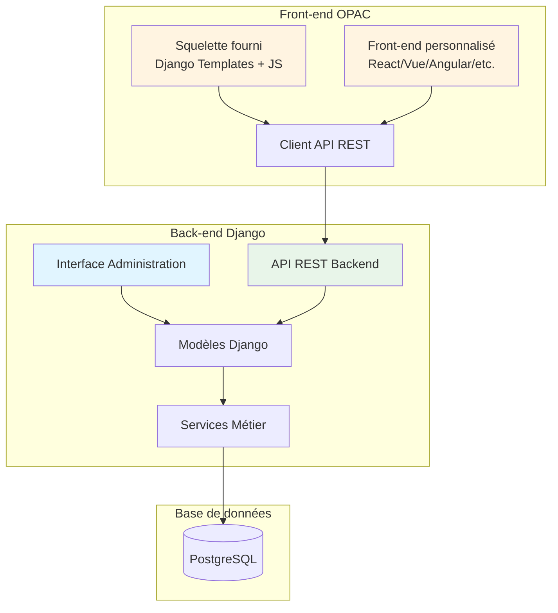
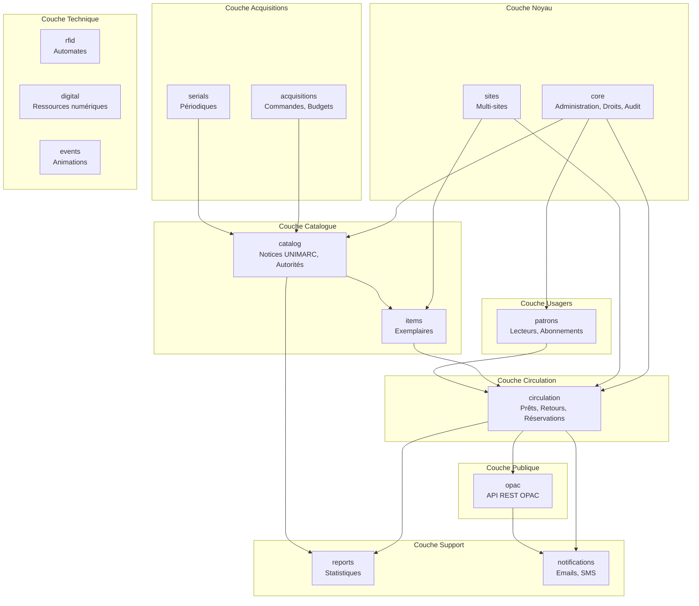
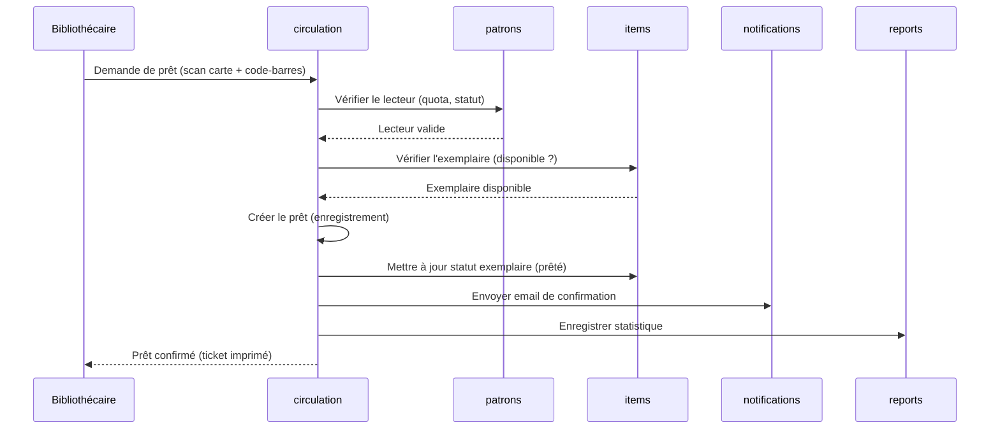
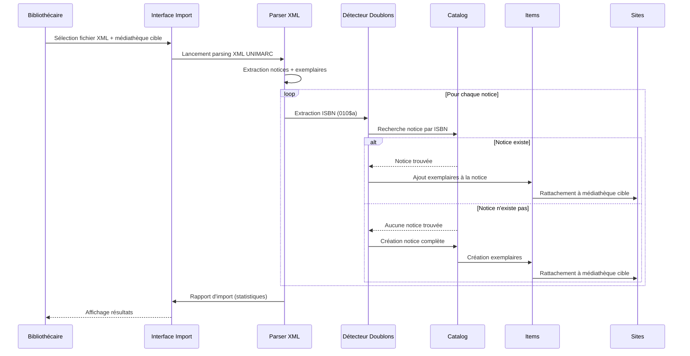

# Architecture Technique

Ce document décrit l'architecture technique de MediaBib.

## Vue d'ensemble

MediaBib est architecturé en **deux parties distinctes** :

1. **Back-end Django** : Interface d'administration réservée aux médiathèques et administrateurs
2. **Front-end OPAC** : Portail public accessible aux visiteurs, communiquant via API REST

```
┌─────────────────────────────────────────────────────────────────┐
│                    INTERFACE ADMINISTRATION                      │
│              (Back-end Django - Bibliothécaires)                │
│  ┌──────────┐  ┌──────────┐  ┌──────────┐  ┌──────────┐      │
│  │ catalog  │  │circulation│  │  readers │  │ reports  │      │
│  └──────────┘  └──────────┘  └──────────┘  └──────────┘      │
│  ┌──────────┐  ┌──────────┐  ┌──────────┐  ┌──────────┐      │
│  │acquisitions│ │ serials  │  │  sites   │  │   core   │      │
│  └──────────┘  └──────────┘  └──────────┘  └──────────┘      │
└─────────────────────────────────────────────────────────────────┘
                              │
                              ▼
┌─────────────────────────────────────────────────────────────────┐
│                         NGINX                                    │
│                   (Reverse Proxy + SSL)                          │
└─────────────────────────────────────────────────────────────────┘
                              │
              ┌───────────────┼───────────────┐
              ▼               ▼               ▼
┌──────────────────┐ ┌──────────────────────────────────────────┐
│   GUNICORN       │ │         DJANGO REST FRAMEWORK             │
│   (Serveur WSGI) │ │              (API REST)                   │
└──────────────────┘ └──────────────────────────────────────────┘
                              │
                              ▼
┌─────────────────────────────────────────────────────────────────┐
│                     DJANGO 5.2 BACK-END                         │
│  ┌──────────┐  ┌──────────┐  ┌──────────┐  ┌──────────┐        │
│  │ catalog  │  │circulation│  │  readers │  │ reports  │        │
│  └──────────┘  └──────────┘  └──────────┘  └──────────┘        │
│  ┌──────────┐  ┌──────────┐  ┌──────────┐  ┌──────────┐        │
│  │acquisitions│ │ serials  │  │  sites   │  │   core   │        │
│  └──────────┘  └──────────┘  └──────────┘  └──────────┘        │
│  ┌──────────────────────────────────────────────────────┐      │
│  │              opac (API REST uniquement)              │      │
│  └──────────────────────────────────────────────────────┘      │
└─────────────────────────────────────────────────────────────────┘
                              │
              ┌───────────────┼───────────────┐
              ▼               ▼               ▼
┌──────────────────┐ ┌──────────────┐ ┌──────────────┐
│   PostgreSQL     │ │    Redis     │ │   Celery     │
│   (Base de       │ │   (Cache +   │ │   (Tâches    │
│    données)      │ │   Sessions)  │ │   async)     │
└──────────────────┘ └──────────────┘ └──────────────┘
                              ▲
                              │
┌─────────────────────────────────────────────────────────────────┐
│                    FRONT-END OPAC                                │
│              (Portail Public - Visiteurs)                       │
│  ┌──────────────────────────────────────────────────────────┐  │
│  │  Squelette fourni (Django Templates + Vanilla JS)       │  │
│  │  OU Front-end personnalisé (React/Vue/Angular/etc.)      │  │
│  └──────────────────────────────────────────────────────────┘  │
│                         │                                        │
│                         ▼                                        │
│              ┌──────────────────────┐                           │
│              │   API REST (JWT)     │                           │
│              │   /api/v1/opac/      │                           │
│              └──────────────────────┘                           │
└─────────────────────────────────────────────────────────────────┘
```

---

## Architecture Back-end/Front-end

MediaBib est conçu avec une **architecture séparée** entre le back-end d'administration et le front-end public (OPAC). Cette séparation permet une meilleure flexibilité, sécurité et possibilité de personnalisation.

### Vue d'ensemble de l'architecture séparée



### Back-end Django (Administration)

**Public cible** : Bibliothécaires et administrateurs

**Technologies** :
- Django 5.2+ avec templates Django
- Interface complète de gestion (CRUD)
- Authentification par session Django
- Permissions granulaires (RBAC)

**Fonctionnalités** :
- Gestion complète du catalogue (notices, exemplaires, autorités)
- Gestion des lecteurs et abonnements
- Circulation (prêts, retours, réservations, amendes)
- Acquisitions et périodiques
- Statistiques et rapports
- Configuration système
- Gestion multi-sites

**Accès** :
- Interface web complète via navigateur
- URLs : `/admin/`, `/catalog/`, `/circulation/`, etc.
- Authentification requise (utilisateurs staff uniquement)

### Front-end OPAC (Portail Public)

**Public cible** : Visiteurs et lecteurs

**Architecture** :
- **API REST uniquement** : L'application `opac` Django fournit uniquement des endpoints API
- Pas d'interface Django classique pour le public
- **Squelette fourni** : Template de base avec Django Templates + Vanilla JavaScript
- **Front-end personnalisé** : Possibilité de créer un front-end avec n'importe quelle technologie

**Technologies du squelette fourni** :
- Django Templates (structure HTML de base)
- Vanilla JavaScript (ES6+)
- Tailwind CSS / Bootstrap 5
- Accessibilité WCAG 2.1 AA

**Fonctionnalités disponibles via API** :
- Recherche dans le catalogue (simple et avancée)
- Consultation des notices bibliographiques
- Compte lecteur (connexion, profil)
- Prêts en cours et historique
- Réservations en ligne
- Prolongations de prêts
- Suggestions d'achat
- Paniers et sélections
- DSI (Diffusion Sélective de l'Information)

**Accès** :
- URLs API : `/api/v1/opac/`
- Authentification : JWT (JSON Web Tokens)
- CORS activé pour permettre les front-ends externes

### Communication via API REST

**Protocole** : REST API avec JSON

**Authentification** :
- **Back-end admin** : Sessions Django (cookies)
- **Front-end OPAC** : JWT (JSON Web Tokens)

**Base URL API** :
```
https://votre-instance.com/api/v1/
```

**Endpoints principaux** :

| Endpoint | Description | Accès |
|----------|-------------|-------|
| `/api/v1/opac/search/` | Recherche dans le catalogue | Public |
| `/api/v1/opac/records/` | Consultation notices | Public |
| `/api/v1/opac/account/` | Compte lecteur | Authentifié |
| `/api/v1/opac/loans/` | Prêts en cours | Authentifié |
| `/api/v1/opac/holds/` | Réservations | Authentifié |
| `/api/v1/opac/baskets/` | Paniers | Authentifié |

### Squelette Front-end fourni

**Emplacement** : `opac/templates/opac/` et `opac/static/opac/`

**Structure** :
```
opac/
├── templates/opac/
│   ├── base.html              # Template de base
│   ├── index.html             # Page d'accueil
│   ├── search.html            # Page de recherche
│   ├── record_detail.html     # Détail d'une notice
│   ├── account/
│   │   ├── login.html         # Connexion
│   │   ├── dashboard.html     # Tableau de bord lecteur
│   │   └── loans.html         # Prêts en cours
│   └── ...
├── static/opac/
│   ├── css/
│   │   └── opac.css           # Styles de base
│   ├── js/
│   │   ├── api.js              # Client API
│   │   ├── auth.js             # Gestion authentification
│   │   └── search.js           # Recherche
│   └── images/
└── views/
    └── api.py                  # ViewSets API uniquement
```

**Caractéristiques** :
- Design responsive (mobile-first)
- Accessibilité WCAG 2.1 AA
- Intégration API REST complète
- Gestion de l'authentification JWT
- Prêt à être personnalisé

### Front-end personnalisé

**Possibilité** : Les développeurs peuvent créer leur propre front-end avec n'importe quelle technologie en utilisant uniquement l'API REST.

**Technologies supportées** :
- **Frameworks JavaScript** : React, Vue.js, Angular, Svelte, etc.
- **Frameworks CSS** : Tailwind CSS, Bootstrap, Material-UI, etc.
- **Outils de build** : Webpack, Vite, Parcel, etc.
- **Langages** : TypeScript, JavaScript (ES6+)

**Documentation** :
- Documentation complète de l'API REST disponible
- Exemples d'intégration pour différentes technologies
- Schémas OpenAPI/Swagger pour génération de clients

**Avantages** :
- Personnalisation complète de l'interface utilisateur
- Choix de la technologie selon les compétences de l'équipe
- Déploiement indépendant du back-end
- Possibilité de créer des applications mobiles (React Native, Flutter, etc.)

**Exemple d'intégration React** :

```javascript
// Exemple de client API pour React
import axios from 'axios';

const API_BASE_URL = 'https://mediabib.example.com/api/v1/opac';

const apiClient = axios.create({
  baseURL: API_BASE_URL,
  headers: {
    'Content-Type': 'application/json',
  },
});

// Ajouter le token JWT aux requêtes
apiClient.interceptors.request.use((config) => {
  const token = localStorage.getItem('jwt_token');
  if (token) {
    config.headers.Authorization = `Bearer ${token}`;
  }
  return config;
});

// Recherche dans le catalogue
export const searchRecords = async (query) => {
  const response = await apiClient.get('/search/', {
    params: { q: query }
  });
  return response.data;
};

// Connexion lecteur
export const login = async (email, password) => {
  const response = await apiClient.post('/auth/login/', {
    email,
    password
  });
  localStorage.setItem('jwt_token', response.data.access);
  return response.data;
};
```

### Séparation des responsabilités

| Composant | Responsabilité | Technologie |
|-----------|---------------|-------------|
| **Back-end Django** | Logique métier, modèles, API admin | Django, PostgreSQL |
| **API REST** | Exposition des données pour le front-end | Django REST Framework |
| **Front-end squelette** | Interface de base pour OPAC | Django Templates + JS |
| **Front-end personnalisé** | Interface personnalisée (optionnel) | React/Vue/Angular/etc. |

### Avantages de cette architecture

1. **Séparation des préoccupations** : Back-end et front-end indépendants
2. **Flexibilité** : Choix de la technologie front-end
3. **Sécurité** : API séparée avec authentification différenciée
4. **Évolutivité** : Développement et déploiement indépendants
5. **Réutilisabilité** : API utilisable par plusieurs clients (web, mobile, etc.)
6. **Personnalisation** : Chaque bibliothèque peut avoir son propre design

---

## Stack technique

### Backend

| Composant | Technologie | Version |
|-----------|-------------|---------|
| Framework | Django | 5.2+ |
| Langage | Python | 3.10+ |
| Base de données | PostgreSQL | 14+ |
| Cache | Redis | 7+ |
| Tâches async | Celery | 5.3+ |
| Serveur WSGI | Gunicorn | 21+ |

### Backend (Administration)

| Composant | Technologie | Version |
|-----------|-------------|---------|
| Framework | Django | 5.2+ |
| Interface | Django Templates | - |
| Authentification | Django Sessions | - |
| API Framework | Django REST Framework | 3.14+ |

### Frontend OPAC

| Composant | Technologie | Description |
|-----------|-------------|-------------|
| **Squelette fourni** | | |
| HTML | HTML5 sémantique | Templates Django de base |
| CSS | Tailwind CSS / Bootstrap 5 | Framework CSS |
| JavaScript | Vanilla JS (ES6+) | Client API REST |
| **Front-end personnalisé** | | |
| Frameworks | React, Vue.js, Angular, Svelte | Au choix du développeur |
| Build tools | Webpack, Vite, Parcel | Outils de build |
| Langages | TypeScript, JavaScript | Langages supportés |
| **Accessibilité** | WCAG 2.1 AA | Obligatoire pour tous les front-ends |

### Infrastructure

| Composant | Technologie |
|-----------|-------------|
| Reverse Proxy | Nginx |
| SSL | Let's Encrypt |
| CI/CD | GitHub Actions |
| Monitoring | Sentry |

---

## Structure du projet

```
MediaBib/
├── app/                      # Configuration Django principale
│   ├── __init__.py
│   ├── settings.py           # Paramètres (via .env)
│   ├── urls.py               # Routes principales
│   ├── wsgi.py               # Point d'entrée WSGI
│   └── asgi.py               # Point d'entrée ASGI
│
├── home/                     # Application page d'accueil
│   ├── templates/home/
│   ├── tests.py
│   ├── urls.py
│   └── views.py
│
├── catalog/                  # Module Catalogue (à créer)
│   ├── models.py             # Notices, Autorités, Exemplaires
│   ├── views.py
│   ├── forms.py
│   ├── services.py           # Logique métier
│   └── tests/
│
├── circulation/              # Module Circulation (à créer)
│   ├── models.py             # Prêts, Retours, Réservations
│   └── ...
│
├── readers/                  # Module Lecteurs (à créer)
│   ├── models.py             # Lecteurs, Abonnements
│   └── ...
│
├── opac/                     # Module OPAC (à créer)
│   └── ...
│
├── templates/                # Templates globaux
│   └── base.html
│
├── static/                   # Fichiers statiques
│   ├── css/
│   ├── js/
│   └── images/
│
├── docs/                     # Documentation
│
├── tests/                    # Tests globaux
│
├── manage.py
├── requirements.txt
├── .env.example
├── pytest.ini
├── pyproject.toml
└── dev.ps1                   # Script de développement Windows
```

---

## Applications Django

### home
Page d'accueil et pages statiques.

### catalog (à développer)
- **Modèles** : `BibliographicRecord`, `Authority`, `Item`
- **Fonctionnalités** : Catalogage UNIMARC, recherche, import/export

### circulation (à développer)
- **Modèles** : `Loan`, `Reservation`, `Fine`
- **Fonctionnalités** : Prêts, retours, réservations, amendes

### readers (à développer)
- **Modèles** : `Reader`, `Subscription`, `Category`
- **Fonctionnalités** : Gestion des abonnés, quotas

### opac (à développer)
- **API REST uniquement** : Endpoints pour le front-end OPAC
- Pas d'interface Django classique pour le public
- Squelette front-end fourni (optionnel)
- Possibilité de créer un front-end personnalisé avec n'importe quelle technologie

### reports (à développer)
- Statistiques et tableaux de bord

### sites (à développer)
- Gestion multi-sites

---

## Architecture Django - Vue simplifiée

MediaBib est organisé en **14 applications Django**, chacune responsable d'un domaine fonctionnel spécifique. Cette architecture modulaire permet une séparation claire des responsabilités et facilite la maintenance et l'évolution du système.

### Organisation par couches fonctionnelles

Les applications Django sont organisées en 6 couches fonctionnelles principales :



### Les 14 applications Django

| Application | Couche | Rôle principal | Exemple concret |
|-------------|--------|----------------|-----------------|
| **core** | Noyau | Administration système, droits utilisateurs, audit | Créer un utilisateur bibliothécaire avec permissions |
| **sites** | Noyau | Gestion multi-sites (réseau de bibliothèques) | Configurer 3 bibliothèques dans le réseau |
| **catalog** | Catalogue | Notices bibliographiques UNIMARC, autorités | Créer une notice pour "Le Petit Prince" |
| **items** | Catalogue | Exemplaires physiques (cotes, localisations) | Ajouter 5 exemplaires du "Petit Prince" |
| **patrons** | Usagers | Lecteurs, abonnements, catégories | Inscrire un nouveau lecteur |
| **circulation** | Circulation | Prêts, retours, réservations, amendes | Prêter un livre à un lecteur |
| **acquisitions** | Acquisitions | Commandes, budgets, fournisseurs | Commander 10 nouveaux livres |
| **serials** | Acquisitions | Périodiques, abonnements, bulletinage | Gérer l'abonnement au "Monde" |
| **opac** | Publique | API REST pour le portail public | Rechercher "Harry Potter" via l'API |
| **rfid** | Technique | Intégration automates de prêt/retour | Scanner un livre avec un automate |
| **digital** | Technique | Ressources numériques (e-books, PNB) | Ajouter un e-book au catalogue |
| **events** | Technique | Animations et événements culturels | Créer un événement "Heure du conte" |
| **reports** | Support | Statistiques, tableaux de bord, exports | Générer le rapport mensuel de prêts |
| **notifications** | Support | Emails, SMS, alertes automatiques | Envoyer un rappel de retour en retard |

### Principe modulaire Django

Chaque application Django est **indépendante** mais peut **communiquer** avec les autres :

- **Indépendance** : Chaque application a ses propres modèles, vues, templates et tests
- **Communication** : Les applications communiquent via les modèles Django (ForeignKey, ManyToMany)
- **Réutilisabilité** : Une application peut être développée et testée séparément
- **Évolutivité** : Ajouter une nouvelle fonctionnalité n'impacte pas les autres applications

**Exemple** : L'application `circulation` utilise les modèles de `patrons` (lecteurs) et `items` (exemplaires) pour créer un prêt, mais elle reste indépendante dans son code.

### Exemple de flux de données : Prêt d'un document

Voici comment les applications interagissent lors d'un prêt :



**Explication étape par étape** :

1. Le bibliothécaire scanne la carte du lecteur et le code-barres du document
2. L'application `circulation` vérifie auprès de `patrons` si le lecteur peut emprunter (quota, amendes)
3. `circulation` vérifie auprès de `items` si l'exemplaire est disponible
4. Si tout est valide, `circulation` crée l'enregistrement de prêt
5. `circulation` met à jour le statut de l'exemplaire dans `items` (de "disponible" à "prêté")
6. `circulation` demande à `notifications` d'envoyer un email de confirmation
7. `circulation` enregistre une statistique dans `reports`
8. Le bibliothécaire reçoit la confirmation et peut imprimer un ticket

### Avantages de cette architecture

1. **Clarté** : Chaque application a un rôle précis et facilement identifiable
2. **Maintenabilité** : Modifier une fonctionnalité n'impacte que l'application concernée
3. **Testabilité** : Chaque application peut être testée indépendamment
4. **Évolutivité** : Ajouter de nouvelles fonctionnalités est simple (nouvelle application ou extension)
5. **Collaboration** : Plusieurs développeurs peuvent travailler en parallèle sur différentes applications

---

## Flux de données

### Prêt d'un document

```
┌──────────┐    ┌──────────┐    ┌──────────┐    ┌──────────┐
│ Lecteur  │───▶│ Scanner  │───▶│   Vue    │───▶│ Service  │
│          │    │ (RFID)   │    │ prêt     │    │ prêt     │
└──────────┘    └──────────┘    └──────────┘    └──────────┘
                                                      │
                                                      ▼
                                               ┌──────────┐
                                               │  Modèle  │
                                               │   Loan   │
                                               └──────────┘
                                                      │
                                                      ▼
                                               ┌──────────┐
                                               │   Base   │
                                               │ données  │
                                               └──────────┘
```

### Recherche dans le catalogue

```
┌──────────┐    ┌──────────┐    ┌──────────┐    ┌──────────┐
│Utilisateur│───▶│ Formulaire│───▶│  Vue     │───▶│ QuerySet │
│          │    │ recherche │    │ search   │    │ optimisé │
└──────────┘    └──────────┘    └──────────┘    └──────────┘
                                                      │
                                                      ▼
                                               ┌──────────┐
                                               │ Résultats│
                                               │ paginés  │
                                               └──────────┘
```

### Import depuis PMB (XML UNIMARC)



---

## Sécurité

### Couches de sécurité

1. **HTTPS** : Chiffrement SSL/TLS
2. **CSRF** : Protection contre les attaques CSRF
3. **XSS** : Échappement automatique Django
4. **SQL Injection** : ORM Django paramétré
5. **Authentication** : Django auth + sessions sécurisées
6. **Authorization** : Permissions par groupe/utilisateur

### Headers de sécurité

```python
# settings.py (production)
SECURE_SSL_REDIRECT = True
SECURE_HSTS_SECONDS = 31536000
SECURE_CONTENT_TYPE_NOSNIFF = True
X_FRAME_OPTIONS = "DENY"
```

---

## Performance

### Optimisations

1. **Requêtes SQL**
   - `select_related()` pour les ForeignKey
   - `prefetch_related()` pour les ManyToMany
   - Index sur les champs recherchés

2. **Cache**
   - Redis pour le cache applicatif
   - Cache des templates en production
   - Cache des sessions

3. **Assets**
   - Minification CSS/JS
   - Compression Gzip/Brotli
   - CDN pour les fichiers statiques

---

## Normes et standards

| Norme | Description | Usage |
|-------|-------------|-------|
| UNIMARC | Format de notices bibliographiques | Catalogage |
| ISO 2709 | Échange de notices | Import/Export |
| Z39.50 | Protocole de recherche fédérée | Recherche externe |
| SRU/SRW | API de recherche | Web services |
| SIP2 | Communication automates | RFID |
| WCAG 2.1 | Accessibilité web | Interface |
| RGPD | Protection des données | Conformité |

